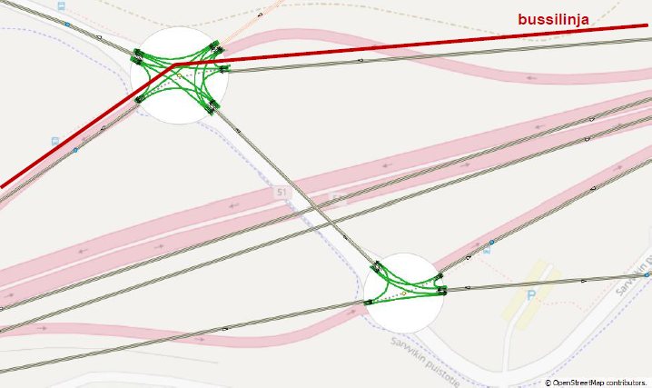
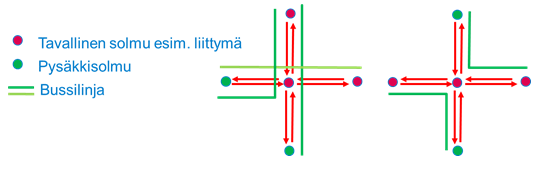
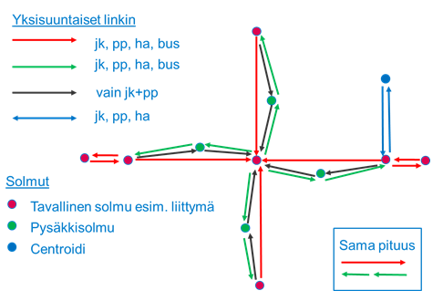
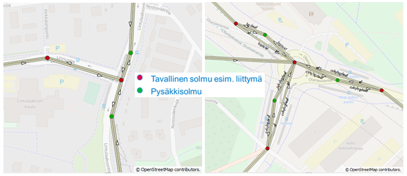
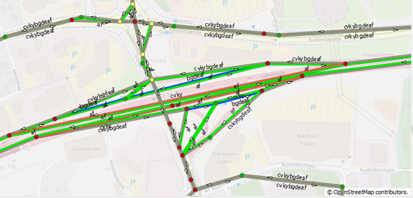
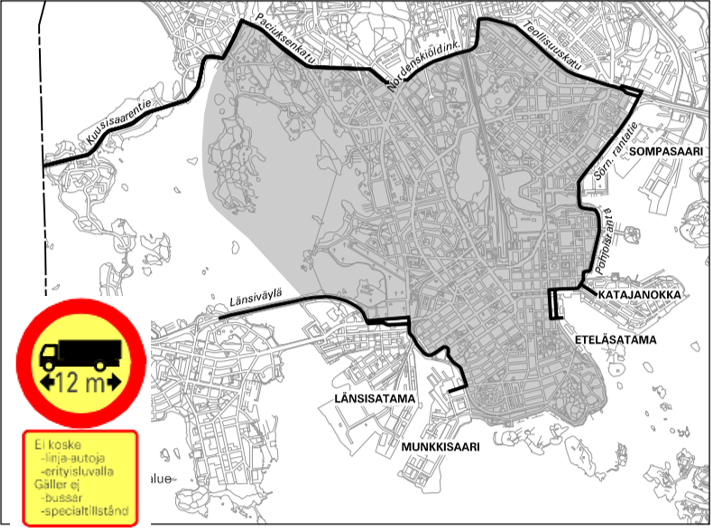
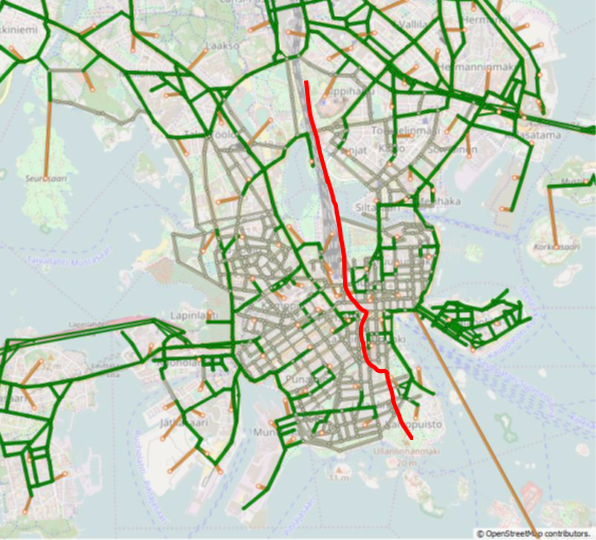

# Emme-verkon kuvaus
{: .no_toc }

Tässä kerrotaan millä periaatteilla Emmen liikenneverkko ja joukkoliikennelinjasto on luotu.
Noudatathan näitä periaatteita verkonkuvauksia koodatessa, jotta varmistutaan tulosten oikeellisuudesta ja aineistojen yhteiskäyttöisyydestä.
Jos teet merkittäviä muutoksia, esim. lisäät uuden kulkumuodon, sovi tästä erikseen HSL:n yhteyshenkilöiden kanssa.

## Sisällysluettelo
{: .no_toc .text-delta }

1. TOC
{:toc}

## Ohjeen muutoshistoria

- 2024-02-05: Lisätty linkkityyppi 43 (hidas pääkatu)
- 2023-05-23: Korjattu virhe sentroidien numeroinnissa (erikoissentroidit 30 000 -> 31 000 ja Siuntion viimeinen sentroidi)
- 2022-01-03: Lisätty tarkennuksia type-attribuutin koodaukseen ja
  us2-kertoimen laskentaan. ([HSLdevcom/helmet-ui#156](https://github.com/HSLdevcom/helmet-ui/pull/156))
- 2022-09-29: Korjattu kolme kuvaa, joista puuttui merkintöjä; lisätty
  muutoshistoria tämän ohjeen yhteyteen
  ([HSLdevcom/helmet-ui#152](https://github.com/HSLdevcom/helmet-ui/pull/152))
- 2022-09-12: Ohje siirretty nettiin; tarkennettu kulkumuoto `h`:n
  ohjeistusta; linkkien `type` ylikirjoittaa `vdf`-, `ul1`- ja
  `ul2`-attribuutit.
  ([HSLdevcom/helmet-ui#145](https://github.com/HSLdevcom/helmet-ui/pull/145))
- 2021-08-12: Kulkumuoto h
- 2021-02-10: Lisätty: Pyörätiet käyttävät autoverkon solmuja.
- 2021-01-28: Lisätty Pikaratikkapysäkki ui2 =8
- 2020-12-28: Täsmennetty ohjetta syöttölinkeistä. Syöttölinkit koodattava aina bussiverkkoon /kävelyverkkoon ja siitä vaihtolinkillä raideliikenteeseen. Lisätietoja luku 6.6.
- 2020-08-05: Korjattu ja täydennetty

 

# Liikenneverkko

## Solmut

### Solmunumerot

Taulukoissa mainitut ”villit solmut” ja ”villit sentroidit” ovat vapaasti käytettävissä olevia numeroita
eri tahojen omiin tarkasteluihin ja hankkeisiin, joita ei ole tarkoituskaan viedä virallisiin HSL:n verkkoihin.
Työn loputtua HSL päivittää tarvittaessa valitun vaihtoehdon osaksi virallisia kuvauksia.

HSL:n virallisia verkkoja muokattaessa on pyydettävä HSL:stä solmunumerot, joita tietyn hankkeen koodaamiseen käytetään.
Virallisissa verkoissa käytettävät solmunumerot ovat taulukoiden solmuavaruuksissa, joiden kohdalla lukee ”HSL:n hankkeiden” solmut.

HUOM: MAL-työn yhteydessä voidaan koodata muutoksia suoraan verkon virallisille solmunumeroille.
Tästä on sovittava HSL:n yhteyshenkilöiden kanssa erikseen.

*Taulukko 1. Solmuavaruuden jako, sentroidit*

| numeroavaruus | selitys | aliavaruudet  | selitys ja huomiot |
|---------------|---------|---------------|--------------------|
| 1-31 999      | sentroidit, tavalliset (aiemmin 1-30 999) | | kunnittain tuhatluvun (1 tai 2 ensimmäisen numeron) perusteella, ks. tarkemmin kohta [Sentroidien numerointi](#sentroidien-numerointi) |
| 32 000–33 999 | varautuminen mm. pysäköintiaitoksiin, kauppakeskuksiin, urheilulaitoksiin jne. |33 000–33 999 
| 34 000–34 999 | sentroidit, ulkosyötöt (aiemmin 31 000 -> 31 999) | 34 000–34 299 (käytössä 34 000–34 036) | ulkosyötöt, autoväylät |
|               |         | 34 300–34 399 (käytössä 34 300–34 302) | ulkosyötöt, junaradat |
|               |         | 34 400–34 499 | ulkosyötöt, lentoasema(t) |
|               |         | 34 500–34 599 | ulkosyötöt, satamat |
|               |         | 34 600–34 999 | tyhjää tilaa vielä tuntemattomien kulkumuotojen  ulkosyötöille |
| 35 000-35 999 | liityntäpysäköintilaitokset| 35 000-35 999 (käytössä 35 000-35 096) | 
| 36 000–39 999 | ”villit sentroidit” | 36 000–39 999 | tilaa vapaisiin tarkasteluihin, joissa halutaan lisätä sentroideja olemassa olevien sentroidien perään |

Erikoissentroideista verkolle on lisätty omat sentroidit Helsinki-Vantaan lentoasemalle ja Helsingin satamille:
- Lentoasema: i = 34 400
- Katajanokka: i = 34 500
- Eteläsatama: i = 34 501
- Länsisatama: i = 34 502
- Vuosaaren satama: i = 34 503

*Taulukko 2. Solmuavaruuden jako, muut solmut kuin sentroidit*

| numeroavaruus   | selitys                                               | aliavaruudet    | selitys ja huomiot                              |
|-----------------|-------------------------------------------------------|-----------------|-------------------------------------------------|
| 40 000–799 999  | solmut, katu- ja tieverkko (sisältää myös erilliset kevyen liikenteen yhteydet) | 40 000–599 999 |                        |
|                 |                                                       | 600 000–799 999 | ”villit” solmut                                 |
| 800 000–800 999 | metroverkon solmut                                    | 800 000–800 499 | ”HSL:n hankkeiden” solmut                       |
|                 |                                                       | 800 500–800 999 | ”villit” solmut                                 |
| 801 000–801 999 | junaverkon solmut                                     | 801 000–801 499 | ”HSL:n hankkeiden” solmut                       |
|                 |                                                       | 801 500–801 999 | ”villit” solmut                                 |
| 802 000–819 999 | raitiovaunuverkon solmut + pikaraitiotieverkon solmut | 802 000–805 999 | nykyinen ja nykyisenkaltainen raitiovaunuverkko |
|                 |                                                       | 806 000–809 999 | ”villit” solmut                                 |
|                 |                                                       | 810 000–815 999 | erillinen pikaraitiotieverkko (Esim. PR15, Vantaan raitiotie)* |
|                 |                                                       | 816 000–819 999 | ”villit” solmut                                 |

*) Käytännössä tulee eteen tilanteita, joissa (pika)raitiolinja halutaan koodata ajamaan reittiä,
joka sisältää sekä nykyisenkaltaista raitiotieverkkoa että pikaraitiotieverkkoa.
Silloin valitaan käytettäväksi jommankumman solmunumerot uusien reittien osalta.

### Solmujen ominaisuudet

Pysäkkityypit on koodattava erityisen huolellisesti, sillä raitiovaunu- ja bussilinjojen pysähtyminen perustuu solmuihin koodattuihin pysäkkityyppeihin.
Tietoja käytetään pysähtymistietoskriptissä.

*Taulukko 3. Solmujen attribuuttitiedot*

| attribuutti      |       | selitys                                                      |
|------------------|-------|--------------------------------------------------------------|
| solmuattribuutti | ui1   | väliaikainen tieto, VAPAA                                    |
| solmuattribuutti | ui2   | solmun tyyppi, ks. taulukko 4                                |
| solmuattribuutti | ui3   | sen kunnan kelakoodi, jossa solmu sijaitsee (ks. taulukko 5) |
| solmuattribuutti | label | joukkoliikenteen lippuvyöhyke (A, B, C tai D) tai tieto muista kunnista joilla on omat lipputuotteensa: Järvenpää (J), Nurmijärvi (N), Vihti (V), Mäntsälä/Hyvinkää (M), Pornainen (P) |
| extra-attribuutti| @korkeus| vaihtoehtoinen tapa esittää mäkisyyttä pyörätieverkolla, käytettävissä esimerkiksi pyörätiesiltojen mallinnuksessa. Vaatii, että @kaltevuus linkkiattribuutti asetetaan nollaan.

*Taulukko 4. Solmutyypit (ui2) ja niiden selitykset*

| koodi (ui2) | kuvaus                                                                  |
|-------------|-------------------------------------------------------------------------|
| 0           | muu solmu                                                               |
|             |                                                                         |
| 1           | raitiovaunupysäkki                                                      |
|             |                                                                         |
| 2           | bussipysäkki paikallisliikenne (sis. vakiovuorot)                       |
| 3           | bussipysäkki paikallis- ja runkoliikenne                                |
| 4           | bussipysäkki paikallis- ja pikavuoroliikenne                            |
| 5           | bussipysäkki paikallis-, runko- ja pikavuoroliikenne                    |
| 6           | bussipysäkki muu                                                        |
| 7           | pikavuoropysäkki                                                        |
| 8           | raitiovaunu- ja pikaratikkapysäkki                                      |
| 11          | bussiterminaali                                                         |
|             |                                                                         |
| 12          | varaus ratikka- tai pikaratikkaterminaalille                            |
| 13          | metroasema (myös asemavaraus)                                           |
| 14          | rautatieasema (myös asemavaraus)                                        |
|             |                                                                         |
| 20          | liittymä (ei pysäkki)                                                   |
| (21-39)     | (varalla, jos liittymien tyyppejä tai osia halutaan eritellä tarkemmin) |
|             |                                                                         |
| 40          | liityntäpysäköinti (sentroidi)                                          |
| (41-49)     | (varalla, jos pysäköintialueiden tyyppejä halutaan eritellä tarkemmin)  |
|             |                                                                         |
| 50          | kauppakeskus (sentroidi)                                                |
| 60          | urheilulaitos (sentroidi)                                               |
| 70          | satama (sentroidi)                                                      |
| 80          | lentoasema (sentroidi) (huom. lentomatkustajille)                       |
|             |                                                                         |
| 90          | normaali sentroidi (sijoittelualueita vastaavat)                        |
| 91          | ulkosyöttö, autoväylät (sentroidi)                                      |
| 92          | ulkosyöttö, junaradat (sentroidi)                                       |

Bussiterminaalit on kuvattu pääsääntöisesti yhdellä solmulla (ui2=11), jossa kaikki terminaalin bussilinjat pysähtyvät.
Kampin terminaalissa on kuitenkin kuvattu paikallis- ja kaukoliikenteen terminaalit omina solmuinaan.

*Taulukko 5. Mallialueen kuntien kelakoodit (ui3) (vuoden 2019 kuntajako)*

| kunta       | kelakoodi (ui3) | kunta       | kelakoodi (ui3) | kunta     | kelakoodi (ui3) |
|-------------|-----------------|-------------|-----------------|-----------|-----------------|
| Askola      | 18              | Kauniainen  | 235             | Pornainen | 611             |
| Espoo       | 49              | Kerava      | 245             | Porvoo    | 638             |
| Hanko       | 78              | Kirkkonummi | 257             | Pukkila   | 616             |
| Hattula     | 82              | Kärkölä     | 316             | Raasepori | 710             |
| Hausjärvi   | 86              | Lahti       | 398             | Riihimäki | 694             |
| Helsinki    | 91              | Lapinjärvi  | 407             | Salo      | 734             |
| Hollola     | 98              | Lohja       | 444             | Sipoo     | 753             |
| Hyvinkää    | 106             | Loppi       | 433             | Siuntio   | 755             |
| Hämeenlinna | 109             | Loviisa     | 434             | Somero    | 761             |
| Inkoo       | 149             | Myrskylä    | 504             | Tammela   | 834             |
| Janakkala   | 165             | Mäntsälä    | 505             | Tuusula   | 858             |
| Järvenpää   | 186             | Nurmijärvi  | 543             | Vantaa    | 92              |
| Karkkila    | 224             | Orimattila  | 560             | Vihti     | 927             |

### Sentroidien numerointi

Sijoittelualueet on numeroitu kunnittain seuraavan taulukon mukaisesti.

*Taulukko 6. Sijoittelualueiden numerointi*

| kunta       | numerot       | kunta       | numerot       | kunta       | numerot       |
|-------------|---------------|-------------|---------------|-------------|---------------|
| Helsinki    |    100–1 999  | Pornainen   | 15 000–15 499 | Salo        | 24 000–24 499 |
| Espoo       |  2 000–3 499  | Siuntio     | 15 500–15 999 | Somero      | 24 500–24 999 |
| Kauniainen  |  3 500–3 999  | Raasepori   | 17 000–17 499 | Hämeenlinna | 25 000–25 999 |
| Vantaa      |  4 000–5 999  | Hanko       | 17 500–17 999 | Janakkala   | 26 000–26 499 |
| Kirkkonummi |  6 000–6 999  | Inkoo       | 18 000–18 499 | Hattula     | 26 500–26 999 |
| Vihti       |  7 000–7 999  | Karkkila    | 18 500–18 999 | Loppi       | 27 000–27 499 |
| Nurmijärvi  |  8 000–8 999  | Lohja       | 19 000-19 999 | Tammela     | 27 500–27 999 |
| Tuusula     |  9 000–9 999  | Porvoo      | 20 000–20 999 | Riihimäki   | 28 000–28 999 |
| Kerava      | 10 000–10 999 | Pukkila     | 21 000–21 499 | Hausjärvi   | 29 000–29 499 |
| Järvenpää   | 11 000-11 999 | Askola      | 21 500–21 999 | Kärkölä     | 29 500–29 999 |
| Sipoo       | 12 000–12 999 | Myrskylä    | 22 000–22 499 | Orimattila  | 30 000–30 499 |
| Mäntsälä    | 13 000–13 999 | Lapinjärvi  | 22 500–22 999 | Hollola     | 30 500–30 999 |
| Hyvinkää    | 14 000–14 999 | Loviisa     | 23 000–23 999 | Lahti       | 31 000–31 999 |

## Kulkumuodot ja joukkoliikenteen ajoneuvotyypit

Verkolla käytetyt kulkumuodot (modes) ja joukkoliikenteen ajoneuvotyypit (vehicles):
- Pääkulkumuodon (auto) h on oltava linkillä sallittu, jos halutaan määrittää esim. kääntymiskieltoja.
  Verkon koodauksessa kannattaa aina sallia kulkumuoto h.
  Pääkulkumuoto poistuu automaattisesti linkeiltä sijoittelun yhteydessä
  (joten **se ei saa olla linkin ainoa kulkumuoto!**):
  - Autosijoittelussa h on sallittu vain autolinkeillä (c)
  - Polkupyöräsijoittelussa h on sallittu vain pyörälinkeillä (f)
- Bussiliikenteessä on erotettu erilaisen pysähtymiskäyttäytymisen linjat:
  HSL:n alueella runko-linjat tavallisista bussilinjoista ja VALLU-linjoissa pikavuorot tavallisista vuoroista.
- Tavaraliikenteessä on kolme erilaista kulkumuotoa.

*Taulukko 7. Kulkumuotojen (modes) kuvaus*

| kulkumuoto (mode) | kuvaus                                                              |
|-------------------|---------------------------------------------------------------------|
| h                 | pääkulkumuoto                                                       |
| c                 | auto                                                                |
| b                 | HSL:n bussi                                                         |
| g                 | HSL:n runkolinja                                                    |
| d                 | muu bussi (kaukoliikenne)                                           |
| e                 | pikavuoro (kaukoliikenne)                                           |
| m                 | metro                                                               |
| r                 | lähijuna                                                            |
| j                 | kaukojuna                                                           |
| t                 | ratikka                                                             |
| p                 | pikaratikka                                                         |
| w                 | vesiliikenne joukkoliikennemuotona (”water”)                        |
| v                 | pakettiauto (”van”)                                                 |
| k                 | kuorma-autot ilman perävaunua                                       |
| y                 | perävaunulliset kuorma-autot (”yhdistelmä”)                         |
| a                 | kävely sis. vaihtokävely                                            |
| s                 | syöttökävely, ulkosyöttö (vain konnektoreilla)                      |
| f                 | polkupyörä (”fillari”) (kadut, erilliset pyörätiet ja syöttölinkit) |

  

 *Taulukko 8. Joukkoliikenteen ajoneuvotyypit (vehicles), niitä vastaavat kulkumuodot ja kuvaus*
 
| ajoneuvotyyppi (vehicle) | kulkumuoto (mode) | kuvaus              |kapasiteetti (istumapaikkaa/yhteensä) |
|--------------------------|-------------------|---------------------|---------------------|
| 1                        | d                 | vakiovuoro          | 66/66               |
| 2                        | e                 | pikavuoro           | 66/66               |
| 3                        | b                 | HSL-bussi           | 49/78               |
| 4                        | m                 | metro               | 260/708             |
| 5                        | r                 | lähijuna, 2-yksikköä| 520/840             |
| 6                        | j                 | kaukojuna           | 660/660             |
| 7                        | t                 | ratikka             | 84/151              |
| 8                        | g                 | HSL-runkobussi      | 49/78               |
| 9                        | w                 | lautta              | 350/350             |
| 10                       | p                 | pikaratikka         | 110/198             |
| 11                       | g                 | nivelbussi          | 52/105              |
| 12                       | e                 | 2-kerrosbussi       | 99/99               |
| 13                       | r                 | lähijuna, 1-yksikkö | 260/420             |
| 14                       | r                 | lähijuna, 3-yksikköä| 780/1260            |

## Linkit

### Linkkien ominaisuudet

*Taulukko 9. Linkkien ominaisuudet*

| kenttä          | autoliikenne                                                 | raideliikenne   | kävely- ja pyöräilylinkit           |
|-----------------|--------------------------------------------------------------|-----------------|-------------------------------------|
| type            | ks. taulukko 10                                              | ks. taulukko 10 | ks. taulukko 10                     |
| length          |                                                              |                 |                                     |
| lanes           | kaistamäärä, bussikaista sisältyy ilmoitettuun kaistamäärään | 1               | 1                                   |
| modes           | hcvkybgde                                                    | htp, hm, hrj    | haf                                 |
| vdf             | sijoittelufunktion nro                                       | ei käytössä (0) | ei käytössä (0)                     |
| ul1 | linkin yhden kaistan kapasiteetti | raitiovaunuverkko: aamu-, päivä- ja iltaliikenteen nopeus, juna- ja metroverkko: ei käytössä (0) | ei käytössä (0) |
| ul2             | linkin vapaa nopeus                                          | ei käytössä (0) | ei käytössä (0)                     |
| ul3             | autoliikenteen linkeille sijoitellaan aluksi raskas liikenne, ja tulokset tallennetaan linkkiattribuuttiin ul3 (oltava link user datassa eikä extra-attribuutissa, jotta tietoa voidaan käyttää sijoittelufunktioissa)         | ei käytössä (0) | ei käytössä (0)                     |
| @pyoratieluokka | pyörätien laatuluokka (taulukko 12)                          | ei käytössä (0) | pyörätien laatuluokka (taulukko 12) |
| @kaltevuus      | linkin pituuskaltevuus (ei hyödynnetty)                      | ei käytössä     | linkin pituuskaltevuus (mäkisyyden mallinnus)|

### Linkkityypit, väyläluokat ja sallitut kulkutavat

Sijoitteluskripti ylikirjoittaa linkien funktio-, nopeus- ja kapasiteettiattribuutit (vdf, ul1,
ul2) type-attribuutin perusteella eli niitä ei tarvitse koodata erikseen. Tiedot löytyvät
attribuuteista sijoittelun jälkeen. Kaikille katu- ja tieverkon linkeille ei kuitenkaan ole saatu
tuotettua taulukko 11:n mukaista linkkityyppiä. Näiden linkkien tyypiksi on koodattu 191-195 (sekä
291-295, 391-395, ... linkeille, joilla on bussikaista tai jotka ovat joukkoliikennekatuja, ja
jotka eivät noudata taulukkoa 11), ja niiden alkuperäiset ul1- ja ul2-attribuutit säilyvät
sijoittelun aikana. Niiden vdf-attribuutti päätellään kuten taulukossa 10 kerrotaan.

Muilla kuin autolinkeillä noudatetaan yleisesti periaatetta vdf = 0, ul1 = 0, ul2 = 0, ul3 = 0, ellei näillä ole jotain erikoismerkitystä (kuten ul1 ratikoilla). 
Sijoitteluskripti muuttaa linkin vdf-attribuutin nollaksi, jos type ei ole taulukko 10 mukaan.

Bussikaista otetaan huomioon sijoittelufunktioissa, jolloin henkilöautoilta vähennetään yksi kaista bussikaistan voimassaoloaikana.
Bussien nopeus bussikaistalla määritetään vapaan nopeuden ja bussien viiveparametrien perusteella.
Bussien nopeus bussikaduilla ja -rampeilla (linkkityypit 6xx), joilla henkilöautoliikenteen nopeutta ei ole, määräytyy kuten bussikaistallisilla linkeillä.
Ne on koodattu kuin aina voimassa olevat bussikaistat, ja funktiomakrot käsittelevät niitä sellaisina.

Kävely ja pyöräily on lähtökohtaisesti sallittua autolinkeillä ja kiellettyä raideliikenteen linkeillä.
Ratikka- ja pikaratikkalinkeille voi koodata kävelyn/pyöräilyn (”taf”, ”paf”, ”tpaf”), jos ei ole rinnakkaista ajoneuvolinkkiä, jolle kävelyn voisi koodata.
Metro- ja junaradoilla kävelyä/pyöräilyä ei kuitenkaan voi sallia (eli ”maf”, ”rjaf” eivät ole sallittuja).
Autolinkkejä, joilla kävely ja pyöräily eivät ole sallittuja, voi koodata tarpeen mukaan, kuten tunnelit (esimerkiksi Kampin terminaalissa) ja moottoritiet.
Käytännössä pyöräily on verkossa sallittu kaikkialla missä kävelykin, joitakin poikkeuksia lukuun ottamatta.
Muutamissa paikoissa on erikseen estetty pyöräily, jos se ei ole todellisuudessa mahdollista.
Aiemmista malliversioista poiketen pyöräilyä ei tule kuvata moottoritiemäisille linkeille, vaan mahdollisuuksien mukaan omina linkkeinään. Näin saadaan paremmin kuvattua moottoritien aiheuttama estevaikutus, sekä reitin mäkisyysvaikutukset. Tällä ei kuitenkaan ole merkitystä Helsingin seudun ulkopuolella, missä pyöräilyä ei muutenkaan ole mallinnettu.

*Taulukko 10. Linkkityypit (link type)*

| linkkityyppi (link type) | selitys                                                                      | modes (tässä h on tiputettu pois)            |
|--------------------------|------------------------------------------------------------------------------|----------------------------------------------|
| 1       | poistunut käytöstä (oli käytössä vanhalla verkolla, ei saa koodata)                           |                                              |
| 2       | ratikka                                                                                       | t, ta, taf                                   |
| 3       | metro                                                                                         | m                                            |
| 4       | junat                                                                                         | rj                                           |
| 5       | pikaratikka                                                                                   | p, pa, paf                                   |
| 6       | ratikkahybridi (varaus)                                                                       | tp, tpa, tpaf                                |
| 70      | kävely ja pyöräily sis. vaihtokävely (pois lukien syötöt eli kumpikaan pää ei ole sentroidi, moottoriajoneuvoliikenne ei ole sallittua) | af |
|         | **syöttölinkit erikoissentroideihin (84-86 vielä varauksia)**                                 |                                              |
| 84      | liityntäpysäköinti (vain konnektoreita liipy-solmuihin)                                       | cvkyaf, af                                   |
| 85      | kauppakeskus (vain konnektoreita kauppakeskus-sentroideihin)                                  | cvkyaf, af                                   |
| 86      | urheilulaitos (vain konnektoreita urheilulaitos-sentroideihin)                                | cvkyaf, af                                   |
| 87      | satama (vain konnektoreita satama-sentroideihin)                                              | cvkyaf, af                                   |
| 88      | lentoasema (vain konnektoreita lentoasema-sentroideihin)                                      | cvkyaf, af                                   |
|         | **syöttölinkit tavallisiin sentroideihin ja ulkosyöttöihin**                                  | cvkyaf, af                                   |
| 98      | ulkosyöttölinkki                                                                              | cvkyasf, asf                                 |
| 99      | syöttölinkki                                                                                  | cvkyaf, af                                   |
|         | **katu- ja tieverkon linkit (pl. vain kevyen liikenteen käytössä olevat linkit), ks. seuraava taulukko** |                                   |
| 121–143 | jalankulku, pyöräily, kaikki autot, bussit, ei bussikaistaa                                   | cvkybgdeaf, cvkybgde, cvkbgdeaf, cvkyaf      |
| 221–243 | jalankulku, pyöräily, kaikki autot, bussit, bussikaista vain ruuhka-aikoina                   | cvkybgdeaf, cvkybgde, cvkbgdeaf              |
| 321–343 | jalankulku, pyöräily, kaikki autot, bussit, bussikaista koko päivän                           | cvkybgdeaf, cvkybgde, cvkbgdeaf              |
| 421–443 | jalankulku, pyöräily, kaikki autot, bussit, bussikaista vain aamuruuhkassa (varaus)           | cvkybgdeaf, cvkybgde, cvkbgdeaf              |
| 521–543 | jalankulku, pyöräily, kaikki autot, bussit, bussikaista vain iltaruuhkassa (varaus)           | cvkybgdeaf, cvkybgde, cvkbgdeaf              |
| 621–643 | joukkoliikenneväylä busseille (henkilöautoilu kielletty) (bussikadut, bussirampit yms.)       | bgde, bgdeaf                                 |
| x9v–x9v (esim. 191–195, 199) | linkit ja bussikadut, joilla on taulukosta poikkeavat ul1- ja ul2-arvot verkolla (x = sataluku kuten edellä). Käytetään viivytysfunktiota v=1–5. | cvkybgdeaf, cvkybgde, cvkbgdeaf, cvkyaf |
| 999     | vanhan verkon ”poikkeava linkki”, jonka dokumentaatio puuttuu (tätä linkkityyppiä ei saa koodata enää) |                                     |

  

*Taulukko 11. Sijoittelufunktioiden jako väylätyyppeihin*

| Väyläluokan tunnus | Väyläluokka | Tarkennus | Sijoittelu- funktio (suluissa bussi- kaista- linkkien funktio) | Nopeus- rajoitus | Vapaa nopeus (km/h, ul2) | Kapasi- teetti (S, ul1) | Linkkityyppi: ei bussi-kaistaa, bussikaista ruuhka-aikana, bussikaista koko päivän, bussikaista vain aamuruuhkassa, bussikaista vain iltaruuhkassa, bussiväylä |
|----|--------------------------|----------------------------------------------|------------|-----|---------|----------|-------------------------|
| 21 | Moottoritiet             | moottoritie                                  | fd1 (fd6)  | 120 | 113     | 2100    | 121 221 321 421 521 621 |
| 22 |                          | moottoritie, kaistoja=>3                     |            | 120 | 113     | 1900    | 122 222 322 422 522 622 |
| 23 |                          | moottoritie                                  |            | 100 |  97     | 2000     | 123 223 323 423 523 623 |
| 24 |                          | moottoritie, kaistoja=>3                     |            | 100 |  97     | 1800     | 124 224 324 424 524 624 |
| 25 |                          | moottoritie                                  |            |  80 |  81     | 2000     | 125 225 325 425 525 625 |
| 26 |                          | moottoritie, kaistoja=>3                     |            |  80 |  81     | 1800     | 126 226 326 426 526 626 |
| 27 | Maantiet / Useampikaistaiset kaupunkiväylät eritasoliittymin | maantie, 2 kaistaa | fd2 (fd7) | 100 | 97 | 1900 | 127 227 327 427 527 627 |
| 28 |                          | maantie, kaistoja=>3                         |            | 100 |  97     | 1800     | 128 228 328 428 528 628 |
| 29 |                          | maantie, 2 kaistaa                           |            |  80 |  81     | 1850     | 129 229 329 429 529 629 |
| 30 |                          | maantie, kaistoja=>3                         |            |  80 |  81     | 1800     | 130 230 330 430 530 630 |
| 31 |                          | maantie, 2 kaistaa                           |            |  70 |  73     | 1600     | 131 231 331 431 531 631 |
| 32 |                          | maantie, 2 kaistaa                           |            |  60 |  63     | 1600     | 132 232 332 432 532 632 |
| 33 | Useampikaistaiset pääkadut tasoliittymin valoilla | usea kaista, valot  | fd3 (fd8)  |  70 |  61     | 1450     | 133 233 333 433 533 633 |
| 34 |                          | usea kaista, valot                           |            |  60 |  54     | 1250     | 134 234 334 434 534 634 |
| 35 | Pääkadut                 | esik,pääk, ei valoja                         | fd4 (fd9)  |  50 |  48     | 1150     | 135 235 335 435 535 635 |
| 36 |                          | esik.pääk,valot/kesk.ei valoja               |            |  50 |  44     | 1000     | 136 236 336 436 536 636 |
| 37 |                          | esik. pääkatu, valot tai keskusta,.ei valoja |            |  40 |  41     | 1000     | 137 237 337 437 537 637 |
| 38 | Kokooja-/tonttikadut     | kesk.pääkatu, valot                          | fd5 (fd10) |  50 |  41     |  900     | 138 238 338 438 538 638 |
| 39 |                          | kesk.kokooja                                 |            |  40 |  36     |  750     | 139 239 339 439 539 639 |
| 40 |                          | keskusta, hidas pääkatu                      |            |  40 |  36     |  900     | 140 240 340 440 540 640 |
| 41 |                          | pienet tonttikadut                           |            |  30 |  30     |  600     | 141 241 341 441 541 641 |
| 42 |                          | keskusta, pienet kadut                       |            |  30 |  **12\***|  500     | 142 242 342 442 542 642 |
| 43 |                          | keskustan pääkatu, 30 km/h                   |            |  30 |  30     |  750     | 143 243 343 443 543 643 |

*) Helmet 5:ssä linkin vapaata nopeutta laskettu arvosta 23 arvoon 12. Käytettävä vain kaikkein hitaimmilla kaduilla, esimerkiksi Helsingin kantakaupungissa.

### Kaistamäärät

Linkin lanes-attribuuttiin kuvataan ajoradan kaistamäärä per suunta. Mallijärjestelmässä linkin kapasiteetti kerrotaan kaistamäärällä, minkä takia malliin on määritelty omat linkkityypit moottoriteille, joilla on 3 tai enemmän kaistaa, jolloin ryhmittymiskäyttäytyminen syö osan kapasiteetista ja kapasiteetti olisi liian suuri jos käytettäisiin samaa linkkityyppiä kuin harvempikaistaisilla tieosuuksilla.

Edellä mainitun ryhmittymiskäyttäytymisen takia myöskään liittymäalueiden kääntymiskaistoja ei koodata erikseen, vaan käytetään samaa kaistamäärää kuin risteyksen tai liittymän ulkopuolella. Mallissa kääntymiskaistoja ei varsinaisesti tunnisteta kääntymiskaistoiksi, vaan kääntymiskaistojen koodaaminen kasvattaa kapasiteettia myös vapaasti suoraan ajaville. Kääntyvät ajoneuvot eivät myöskään haittaa muuta liikennettä, koska risteävät liikennevirrat eivät hidasta toisiaan, eikä liikennevaloristeyksiä ole eksplisiittisesti koodattu, vaan liikennevaloja sisältävillä väylillä käytetään eri linkkityyppejä yllä olevan taulukon mukaisesti.

### Nopeus raitiotieverkolla

Nopeus raitiotieverkolla määräytyy linkkiattribuuttiin ul1 koodattujen nopeuksien perusteella.
> `ul1 = aabbcc`, jossa ratikoiden nopeudet `aa = aamuhuipputunti`, `bb = päivä` ja `cc = iltahuipputunti`
Jos aamun nopeus on alle 10 km/h, nopeus kirjoitetaan muodossa `abbcc`.

### Pyöräliikenne

Pyöräliikenneverkossa kaikille linkeille on määritelty pyörätieluokka (0-4) extra atribuuttiin @pyoratieluokka. Luokan avulla kuvataan pyörätieinfran toteuttamisen muotoa ja laatua.
Pyörätien miellyttävyyteen tasaisella maalla vaikuttaa sekä määritelty pyörätieluokka että linkkityyppi seuraavan taulukon mukaan. Lisäksi miellyttävyyteen vaikuttaa reitin mäkisyys siten, että alamäki nopeuttaa kulkua, ja ylämäki hidastaa sitä. Ylämäen hidastusvaikutus on suurempi kuin alamäen nopeutusvaikutus, joten reitinvalinnassa vältetään mäkiä. Pyöräkaistoilla ja sekaliikenteessä myös autoliikenteen määrä samalla katuosuudella vaikuttaa katuosuuden miellyttävyyteen, minkä takia pyörätieluokkien kuvaaminen on aiempaa tärkeämpää, jotta autoliikenteestä ei aiheutuisi haittaa niillä väylillä, joissa haittaa ei todellisuudessa ole.

Baanan määritelmä on tässä seuraava: (1) ei juuri tasoristeyksiä eikä muita esteitä (esim. bussipysäkkejä), 
(2) oma tarpeeksi leveä tila selvästi eroteltu jalankulusta, (3) tasainen, asfaltoitu pinta, ei jyrkkiä mäkiä.
Pyöräkadut kuvataan tilanteen mukaan pääsääntöisesti pyörätieluokkana 3, vaikka katuosuus olisi osana baanaverkkoa. Tämä johtuu siitä, että pyöräkatu ei ole täysin vapaa esteistä johtuen pyöräliikenteen joukossa kulkevasta autoliikenteestä. Tulevaisuudessa, jos pyöräkatuja toteutetaan seudulle useampia, voi olla tarpeen toteuttaa oma luokka pyöräkatuja varten.

Jos moottoritien varressa on pyörätie, sen luokka on yleensä 3 (erillinen pyörätie).
Pyörätiet käyttävät autoverkon solmuja, paitsi moottoriteillä, joiden ympäristössä pyörätiet pyritään koodaamaan erikseen, jotta moottoriteiden aiheuttama estevaikutus ja pyörätien mäkisyys saadaan kuvattua tarkemmin.

*Taulukko 12. Pyörätieluokkien vaikutus. Miellyttävyys kuvataan yleistettynä matkanopeutena*

|                                     | @pyoratieluokka | Linkkityypit | Miellyttävyys tasaisella |
|-------------------------------------|-----------------|--------------|---------------|
| Baana                               | 4               |              | 19            |
| Erillinen pyörätie                  | 3               |              | 17            |
| Pyörätie kadun varressa, maantie    | 2               | 27-32        | 17            |
| Pyörätie kadun varressa, pääkatu    | 2               | 33-37        | 16            |
| Pyörätie kadun varressa, pieni katu | 2               | 38-42        | 15            |
| Pyöräkaista                         | 1               |              | 15            |
| Sekaliikenne, maantie               | 0               | 27-32        | 12            |
| Sekaliikenne, pääkatu               | 0               | 33-40        | 10            |
| Sekaliikenne, pieni katu            | 0               | 41-42        | 12            |

## Mäkisyyden vaikutus pyöräilyyn

Pyöräilyn sijoittelussa reitinvalintaan vaikuttaa myös reitin mäkisyys. Mäkisyys on kuvattu linkkien gradienttina, joka lasketaan solmujen korkeuserosta ja linkin length-attribuutista. Gradientti on tallennettu verkolle @kaltevuus extra-attribuuttina. Lisäksi solmuille on tallennettu uusi @korkeus extra-attribuutti, jota voidaan käyttää vaihtoehtona linkkien kaltevuudelle verkkoja koodatessa.

HSL:n tarjoamille verkoille on haettu Maanmittauslaitoksen 2x2 m -korkeusmallista solmujen korkeustiedot, joista on laskettu linkkien kaltevuudet. Korkeustiedot omille verkoille on mahdollista lisätä käyttämällä [helmet-utils](https://github.com/HSLdevcom/helmet-utils) -Python-kirjastoa. Kirjaston käyttäminen vaatii Maanmittauslaitoksen API-avaimen, jonka voi saada käyttöönsä rekisteröitymällä Maanmittauslaitoksen verkkopalveluun. Rekisteröityminen ja korkeusmallin käyttö on ilmaista.

Vaihtoehtoisesti kaltevuus voidaan laskea myös malliajon aikana solmujen korkeustiedoista. Korkeustietoja hyödynnetään tilanteessa, jossa linkin kaltevuus on 0. Arvioitaessa esimerkiksi baanahankkeiden muutoksia muutosten kohteena olevien linkkien @kaltevuus extra-attribuutit tulee asettaa arvoon 0, jos halutaan käyttää @korkeus extra-attribuutista laskettavia arvoja

## Autoliikenteen vaikutus pyöräilyyn

Autoliikenne haittaa pyöräilyä siten, että samalla linkillä kulkeva autoliikenne laskee pyöräilyn miellyttävyyttä. Ominaisuus on käytössä ainoastaan väylillä, joissa pyöräliikenne tapahtuu sekaliikenteesäsä tai pyöräkaistalla (@pyoratieluokka 0 tai 1). Jos autoliikennettä on hyvin vähän, miellyttävyys kasvaa normaalista, jolloin ero miellyttävyydessä ajoradalla ja erillisellä pyörätiellä laskee.

Mäkisyyden ja autoliikenteen vaikutusten jälkeen lopullinen miellyttävyys saa arvoja välillä 5 &ndash; v*1,5; missä v on yllä olevan taulukon mukainen miellyttävyys tasaisella. Tästä poikkeuksena baanoilla miellyttävyys alamäessä voi olla maksimissaan jopa 35, johtuen selkeästä erottelusta muista liikennemuodoista.

### Kaksiajorataiset kadut

Kaksiajorataiset tiet ja kadut kuvataan verkossa jatkossa siten, että kummankin ajoradan linkeillä käytetään samoja solmupareja.
Poikkeuksen tähän muodostavat moottoritiet, kehätiet ja muut moottoritiemäiset (esim. eritasoliittymin varustetut) väylät.

### Eritasoliittymät ja moottoritiemäiset väylät

Eritasoliittymien ja moottoritiemäisten väylien ajoradat kuvataan erillisinä.
”Tavoitteena on ylläpitää kuvausta, joka vastaa mahdollisimman hyvin fyysistä todellisuutta tai eritasoliittymistä laadittuja suunnitelmia.
Liittymät, joista suunnitelmia ei ole tehty, voidaan kuvata yksinkertaistettuina (esimerkiksi ns. salmiakkikuvaus).”

Seuraavat väylät on verkossa kuvattu kaksiajorataisina:
- Sisääntulotiet / moottoritiet
  - Länsiväylä (kt51): 2-ajoratainen kuvaus Kirkkonummelta Ruoholahteen (Purokummuntie–Porkkalankatu)
  - Turunväylä (vt1): 2-ajoratainen kuvaus verkon ulkoreunalta Huopalahdentielle
  - Vihdintie (mt 120): 2-ajoratainen kuvaus Kehä III:lta Vihdintien ympyrään (Pitäjänmäen ympyrään) – (Tiilipojanlenkki–Pitäjänmäentie)
  - Hämeenlinnanväylä (vt3): 2-ajoratainen kuvaus verkon ulkoreunalta Hakamäentielle
  - Tuusulanväylä (kt45): 2-ajoratainen kuvaus Tuusulasta (Vanhan Tuusulantien liittymästä) Pohjolankadulle
  - Lahdenväylä (vt4): 2-ajoratainen kuvaus verkon ulkoreunalta Koskelantielle
  - Porvoonväylä (vt7): 2-ajoratainen kuvaus verkon ulkoreunalta Lahdenväylälle
  - Itäväylä: 2-ajoratainen kuvaus Itäkeskuksesta Kehä I:n liittymästä Kalasatamaan.
- Kehätiet
  - Kehä I: 2-ajoratainen kuvaus koko matkan Länsiväylältä (Karhusaarensolmusta) Itäkeskukseen (Itäväylän liittymään)
  - Kehä II: 2-ajoratainen kuvaus koko matkan Länsiväylältä (Matinsolmusta) Turuntielle (tie 110)
  - Kehä III: 2-ajoratainen kuvaus Mankinsolmusta (Kauklahdenväylältä) Vuosaaren sata-maan.
- Moottoritiemäiset väylät
  - Lentoasemantie Kehä III:lta pohjoiseen (Virkatie – Helsinki-Vantaan lentoasema), koska sen kaikki liittymät tuolla välillä ovat eritasoliittymiä.

### Kääntymiskiellot

Moottoriteillä on kääntymiskiellolla estetty autoilta poistumisrampilta suoraan liittymisrampille ja takaisin moottoritielle ajaminen
(katkoviivat seuraavassa kuvassa).
Tämä ei kuitenkaan estä bussi-linjojen koodaamista suoraan ramppeja pitkin (punainen viiva seuraavassa kuvassa),
niin että ne pääsevät usein rampeilla sijaiseville pysäkeille. Koodaamisen helpottamiseksi pakotetaan bussit kulkemaan ramppeja pitkin kieltämällä bussikulkumuodot pääväylältä liittymän kohdalla. Samoin autoliikenne voidaan paikoin estää ajamasta ramppien läpi myös poistamalla autokulkumuoto tietyltä linkiltä.

*Kuva 1. Moottoritien ramppien hyödyntäminen suoraan ajamiseen on estetty autoilta (katkoviivat).*

### Kiertoliittymät

Kiertoliittymät kuvataan yhdellä solmulla.
Poikkeuksen muodostavat moottoritiemäiset, eri tasos-sa olevat kiertoliittymät, jotka voidaan tarvittaessa kuvata useammalla solmulla.
Esimerkki useammalla solmulla koodatusta moottoritiemäisestä kiertoliittymästä: Lentoasemantien, Virkatien ja Äyritien liittymä Vantaalla.

### Syöttölinkit

Syöttölinkit ovat linkkejä, jotka yhdistävät sentroidit muulle liikenneverkolle. Syöttölinkit koodataan linkkityypeillä 99 (tavalliset syöttölinkit) tai 98 (ulkosyöttölinkit). Syöttölinkkejä sijoittelualueita kuvaavista solmuista verkoille on kahdenlaisia: ”autosyöttölinkkejä” (joilla myös kävely ja pyöräily on sallittu)
ja ”kävelyn ja pyöräilyn syöttölinkkejä”, joilla autoilu ei ole sallittu. Syöttölinkeille ei koskaan koodata joukkoliikenteen kulkumuotoja.

Etenkin alueilla, joilla pysäköinti on sijoitettu pysäköintilaitoksiin, syöttölinkkien sijoittaminen oikeaan paikkaan on tärkeää, jotta verkko kuormittuu oikealla tavalla.
Autosyöttölinkkejä lähtee kultakin alueelta pääsääntöisesti vain yksi, ja sen lisäksi on kävelyn ja pyöräilyn syöttölinkkejä eri suuntiin.
Tiheästi asutuilla alueilla, joilla verkko on tiheä, syöttölinkkejä on usein neljä (yksi joka suuntaan),
ja harvaan asutuilla alueilla taas on usein järkevää, että syöttölinkkejä on 1 tai 2 (vain lähimmälle tielle). 

Syöttölinkkejä koodatessa on tärkeää pitää huolta siitä, että eri sijoittelualueiden syöttölinkit eivät liity muulle verkolle saman solmun kautta, jotta liikenne sijoittelualueiden välillä kuormittaa liikenneverkkoa. Syöttölinkkien ei myöskään koskaan tule ristetä toisten syöttölinkkien kanssa. Syöttölinkkejä koodatessa voi olla hyödyllistä lisätä Emmeen taso GIS Overlay kerros, ja valita sitten HSL:n sijoittelualuejakoa kuvaava paikkatietoaineisto (.shp muodossa). Emmen datakerroksia lisättäessä on myös hyvä huomata, että kerrokset piirretään alhaalta ylöspäin, eli paikkatietoaineisto ei tule näkyviin, jos se on piirretty ennen taustakarttaa.
Syöttölinkkien ei tulisi mennä suoraan moottoritielle tai raideliikenteen asemille. 

### Vaihtolinkit

Vaihtolinkit koodataan eri kulkumuotojen välille.
Vaihtolinkit ratikkapysäkiltä, metro- ja juna-asemilta koodataan lähimmälle auto/bussiverkon solmulle,
jonka olisi hyvä olla pysäkki, mutta kohteesta riippuen siitä voi poiketa.
Vaihtolinkkien pituudet tulee koodata siten, että vaihtoaika vastaa todellisuutta. Vaihtolinkin pituus voi olla 0 m, jos esimerkiksi samalla fyysisellä pysäkillä on sekä raitio-, että bussiliikennettä.

# Joukkoliikenne

## Bussipysäkkien ja muun bussi-infran kuvaus

Pysäkit koodataan niin, että linjojen pysähtymiskäyttäytymisen kuvaaminen voidaan automatisoida osana malliajoa.
Linjojen pysähtymisiä ei tarvitse kuvata käsin, kunhan pysäkkien kuvaus verkolla pidetään ajantasaisena.

Verkon koodauksessa noudatetaan bussipysäkkien osalta seuraavia periaatteita:
- Pysäkin tyyppi koodataan solmuattribuuttiin ui2. 
- Linjojen pysähtymiset tuotetaan automaattisesti malliajon aikana solmujen ui2-koodeihin ja kaukobusseissa ajosuuntaan perustuen.
- Yhdellä linkillä kuvatuilla kaduilla ja teillä pysäkkiparin vastasuuntien pysäkit yhdistetään useimmiten samaan pysäkkisolmuun.
- Kahdella erillisellä linkillä kuvatuilla teillä (moottoritiemäiset väylät ja eritasoliittymät) pysäkit kuvataan pääosin todellisuutta vastaavasti, 
  eli mm. vastasuuntien pysäkit omille puolilleen.
  Tällöin myös vaihdot eritasoliittymissä kuvautuvat kohtalaisen realistisesti.
- Liittymien ja vuorotarjonnaltaan vilkkaiden katujen kuvaaminen:
  - Yhden solmun kuvaus: kaikki liittymien läheisyydessä olevat pysäkit kuvataan liittymäsolmuun.
    Käytetään HSL-alueen ulkopuolella sekä tarpeen mukaan vastaavilla harvaan asutuilla alueilla myös HSL-alueella.
  - Kolmen solmun kuvaus: Liittymä kuvataan maksimissaan viidellä solmulla, joista kaksi on pysäkkejä.
    Pysäkkisolmut valitaan sen mukaan, miten bussilinjat liittymässä ajavat, niin että jokainen linja pysähtyy täsmälleen yhdellä pysäkillä (kuva 4).
    Käytetään pääsääntöi-sesti HSL-alueen liittymissä.
  - Viiden solmun kuvaus: Viiden solmun kuvaus, jossa risteämiskohta on ainoa solmu, joka ei ole pysäkki,
    ei ole mahdollinen automaattisen pysähtymiskäyttäytymisen kanssa, koska silloin bussit pysähtyisivät liittymässä aina kahdessa solmussa:
    sekä ennen risteämiskohtaa että sen jälkeen.
    Ei käytetä.
  - ”Tuulimylly”: Vastasuuntien pysäkit kuvataan erikseen.
    Käytetään tarjonnaltaan vilkkaissa liittymissä, tärkeimmissä vaihtopaikoissa tai kun vaihtoyhteyksiä muuten halutaan kuvata erityisen realistisesti, 
    sekä silloin, kun kolmen solmun kuvausta ei voida käyttää linjojen kääntymisen geometrian takia.

*Kuva 4. Kolmen solmun kuvaus.*

*Kuva 5. ”Tuulimylly”-kuvaus.*

*Kuva 6. Esimerkki kolmen solmun kuvauksesta (vasen kuva) ja ”tuulimyllystä” (oikea kuva).*

**Moottoritiemäiset bussirampit** on koodattu siten, että niillä on autokulkutavat kielletty (kuva 7, siniset linkit).
Moottoritiemäisillä väylillä, kun bussipysäkit ovat rampeilla, on busseilta kielletty ajaminen suoraan moottoritietä pitkin,
jotta bussilinjat varmasti kulkevat pysäkkien kautta (kuva 7).
Tämä yhtenäistää samalla myös VALLU-linjojen pysähtymiskäyttäytymisen: mallissa kaikki linjat pysähtyvät samoilla pysäkeillä (paitsi pikavuorot
vain pikavuoropysäkeillä), vaikka todellisuudessa kaikki kaukoliikenteen bussit eivät pysähdy kaikilla pysäkeillä.

*Kuva 7. Bussikulkutavat moottoritiemäisillä väylillä. Punaisilla linkeillä bussikulkutavat on kielletty, ja sinisillä linkeillä autokulkutavat on kielletty.
Vihreät linkit ovat kävely- ja pyöräilylinkkejä. Bussi-pysäkit ovat vihreissä solmuissa.*

## Bussi- ja raitioliikenteen automaattinen pysähtymiskäyttäytyminen

[Pysähtymisskripti](https://github.com/HSLdevcom/helmet-model-system/blob/olusanya/Scripts/assignment/emme_assignment.py#L304)
laskee bussien, ratikoiden ja pikaratikoiden pysähtymistiedot solmutyypin (ui2) ja lippuvyöhykkeen perusteella.
Pysäkin label-attribuutin lippuvyöhykkeen tiedon perusteella lasketaan tieto HSL-alueesta.
HSL-alueen vyöhykkeitä ovat A, B, C, D ja E (varaus).
HSL-aluetieto käytetään Vallu-linjojen pysähtymisiin HSL-alueella.
Vallu-linjojen linjatunnuksessa on oltava täsmälleen 6 merkkiä, joista viimeinen kuvaa linjan suuntaa.
Suunta 1 on Helsingistä poispäin ja suunta 2 Helsinkiin. Lisäksi muutamilla linjoilla käytetään suuntatunnusta 3, jolla kuvataan ympyrälinjoja, mutta se ei vaikuta pysähtymiseen koska linjat eivät ylitä HSL-alueen rajaa.
HSL-alueen ulkopuolella kulkevilla linjoilla ei ole suunnalla väliä.

Pysähtymisskripti määrittää vain bussilinjojen (modet b, g, d ja e) ja raitiotie- ja pikaraitiotielinjojen (modet t ja p) pysähtymiset.
Juna- ja metrolinjojen pysähtymiskäyttäytyminen määritetään käsin.
Pysähtymisskripti käsittelee eri bussikulkumuotoja (modet b, g, d ja e) hieman eri tavoin.
Juuri tästä syystä verkolle on määritetty kulkumuodot HSL-runkolinjabussi (mode g) ja pikavuoro (mode e).
Näin jokainen bussikulkumuoto saadaan pysähtymään eri pysäkeillä. 

Bussi- ja raitiolinjojen automaattiseen pysähtymiskäyttäytymiseen tarvitaan tieto pysäkkityypistä, joka on määritetty solmuattribuuttiin ui2.
Kun bussi- ja raitiolinjoihin tehdään muutoksia, saadaan uusilla linjoilla ja muokatuilla osuuksilla pysähtymiset kohdalleen ajamalla skripti uudelleen.
Skripti määrittää aina uusiksi kaikkien bussi- ja raitiolinjojen pysähtymiset, joten jos niiden pysähtymiskäyttäytymisestä halutaan tehdä skriptistä poikkeavaa,
on muokattava skriptiä tai tehtävä poikkeavat muutokset aivan lopuksi.

Pysäkkityyppitiedon lisäksi käytetään tietoa siitä, sijaitseeko solmu HSL-alueella vai ei (lasketaan label-attribuutissa olevan lippuvyöhyketiedon perusteella).
Tämän tiedon avulla on tehtävissä rajoitus, että muilla kuin HSL-busseilla (eli ns. VALLU-linjoilla, joita kuvaavat modet d ja e)
ei voi tehdä HSL-alueen sisäisiä matkoja.
Kaukojunille vastaava rajoitus on koodattava käsin.

Kaukobussiliikenteen HSL-alueen sisäisten matkojen rajoittamiseen käytetään lisäksi tietoa linjan suunnasta: Helsinkiin vai Helsingistä poispäin. 
Skriptissä oletetaan, että suuntatieto on koodattu viimeiseen merkkiin, joten kaikkien VALLU-linjojen nimen on päätyttävä suuntakoodiin 1 tai 2, jotta skripti toimii.

Lisäksi on syytä huomata seuraavat pysähtymiseen vaikuttavat seikat:
- Kaikki bussilinjat pysähtyvät bussiterminaaleissa (ui2 = 11).
- Mikään bussilinja ei pysähdy bussipysäkeillä, jotka on merkitty koodilla ui2 = 6 (muu bus-sipysäkki).
  Näille pysäkeille on siis määritettävä jokin muu koodi, jos ne halutaan ”ottaa käyttöön”.
- Solmutyypeissä on varauduttu ratikka- ja pikaratikkaterminaaleihin (ui2 = 12), mutta näitä ei ole vielä verkolla,
  eikä niitä ole otettu huomioon mallijärjestelmän pysähtymiskäyttäytymisessä.
  Jos verkolla lisätään terminaaleja, mallijärjestelmän pysähtymiskäyttäytymistä on muokattava niin, että raitiolinjat pysähtyvät terminaalissa suunnitellusti.

Eri kulkumuodot pysähtyvät pysäkeille pysäkkitunnusten mukaan seuraavasti: 
- Raitiolinjat (mode t) pysähtyvät kaikilla raitiovaunupysäkeillä (ui2 = 1 tai 8).
- Pikaraitiolinjat pysähtyvät kaikilla pikaraitiovaunupysäkeillä (ui2 = 8)
- Tavalliset HSL-bussit (mode b) pysähtyvät kaikilla reitillään olevilla bussipysäkeillä (ui2 = 2…5) ja bussiterminaaleissa (ui2 = 11).
- HSL:n runkolinjat (mode g) pysähtyvät runkolinjapysäkeillä (ui2 = 3 tai 5) ja bussiterminaaleissa (ui2 = 11).
- ”Muut bussit” (mode d), eli HSL-alueen ulkopuoliset tai HSL:n rajan ylittävät bussilinjat, jotka eivät ole pikavuoroja, pysähtyvät seuraavasti:
  - 1-suuntaan eli Helsingistä poispäin: kyytiin voi nousta kaikilta bussipysäkeiltä, ja bussis-ta voi poistua kaikilla pysäkeillä HSL-alueen ulkopuolella.
  - 2-suuntaan eli Helsinkiin päin: kyytiin voi nousta kaikilta bussipysäkeiltä HSL-alueen ulkopuolella, ja bussista voi poistua kaikilla bussipysäkeillä. 
  - Käytännössä siis kokonaan HSL-alueen ulkopuolella kulkevat linjat pysähtyvät kaikilla pysäkeillä molempiin suuntiin.
- Pikavuorot (mode e) pysähtyvät seuraavasti pikavuoropysäkeillä ui2 = 4, ui2 = 5, ui2=7 tai ui2 = 11 (bussiterminaalit):
  - 1-suuntaan eli Helsingistä poispäin: kyytiin voi nousta kaikilta pikavuoropysäkeiltä, ja bussista voi poistua pikavuoropysäkeillä HSL-alueen ulkopuolella.
  - 2-suuntaan eli Helsinkiin päin: kyytiin voi nousta pikavuoropysäkeiltä HSL-alueen ulkopuolella, ja bussista voi poistua kaikilla pikavuoropysäkeillä.

## Raideliikenteen kuvaus

Junaliikenteen verkko kuvataan linkkityypillä 4 ja metroliikenteen verkko linkkityypillä 3.
Molemmissa verkko koostuu ainoastaan asemia kuvaavista solmuista, erillisiä välisolmuja ei käytetä. Lisäksi mallialueen rajoilla on mallin sisäisten pääteasemien jälkeen solmu johon junaliikenteen ulkosyöttö on yhdistetty. Näin mallialueen ulkopuolelta tulevat matkustajat aloittavat matkansa kaukojunassa, sen sijaan että he valitsisivat esimerkiksi Lahdessa Z-lähiliikenteen junan.
Nopeus juna- ja metroverkolla määräytyy segmenttimuuttujaan us1 tallennettujen asemien välisten matka-aikojen perusteella. Jos segmenttimuuttujaa ei ole asetettu, junan matka-aika asemimen välillä on 0 ja nopeus siten ääretön. 
Matka-aika asemaväleittäin koodataan erikseen kutakin juna- tai metrolinjaa koodattaessa, eikä se ole sidoksissa verkon kuvaukseen. Tämä johtuu siitä, että junien pysähtyminen hidastaa matka-aikaa, joten aseman ohittava juna voi kulkea saman asemavälin pysähtyvää junaa nopeammin.

Lakkautetut juna-asemat Luoma, Mankki, Purola ja Nuppulinna on jätetty verkolle.
Junatyyppejä ei ole eroteltu omille raiteilleen, vaan kaikki junat ovat samoilla linkeillä.
Poikkeuksen asemakoodaukseen muodostaa Pasilan asema, jossa kuvataan päärataa ja rantarataa kahdella erillisellä solmulla
-– ja siten kahdella erillisellä linkkiparilla Helsingin ja Pasilan välillä. 

Juna- ja metroliikenteen pysähtymiskäyttäytyminen koodataan käsin todellisuutta vastaavaksi:
lakkautetuilla asemilla juna ei pysähdy, eli niillä ei voi nousta kyytiin tai jäädä pois.
Vastaavasti nykyisten asemien väliin valmiiksi koodatuilla tulevaisuuden asemilla ei myöskään voi nousta kyytiin tai jäädä pois,
ellei erityisesti ole tarkoitus kuvata sitä, että asema otetaan käyttöön.

Raitiotieverkko on kuvattu autoliikenteestä erillisillä linkeillä.
Linkkien tyyppi on 2. Nopeus raitiotieverkolla määräytyy linkkiattribuuttiin ul1 koodattujen nopeuksien perusteella.
Raitiotieverkolla raitiovaunupysäkit merkitään solmutyypillä ui2 = 1, ja muut solmut solmutyypillä ui2 = 0.
Tällöin linjojen pysähtymiset kuvautuvat automaattisesti oikein pysähtymistietomakrolla.

## Joukkoliikennelinjastot

Malliin koodataan vain tarjonnaltaan merkittävät linjat. Lähilinjoja (palvelulinjoja) ei koodata malliin.
Useamman kirjainvariantin omaavat linjat yhdistetään johonkin toiseen parhaiten kuvautuvaan.
Kirjaa tästä tieto mallitekniseen muistioon.
Myöskään linjojen kiertosuuntien muutoksia (esim. linjalla 993) ei koodata, vaan linjat kulkevat eri vuorokaudenaikoina pääsuunnan mukaisesti.
Jos pääsuuntaa ei ole, niin suunta 1 on pääsuunta.

Linjoille koodataan malliin keskimääräiset vuorovälit (min) aamuruuhkassa (aht, n. 7:30-8:30), päivä-liikenteessä (pt, n. 12-13) ja iltaruuhkassa (iht, n. 16-17). 
Linjojen vuorovälit pyöristetään puolen minuutin tarkkuudella.
Vuoroväli 999 min tarkoittaa, että linja ei liikennöi kyseisenä ajankohtana.

HSL ylläpitää joukkoliikennelinjoista vain yhtä versiota hankevaihtoehtoa kohden.
Eri vuorokaudenaikojen erilaiset vuorovälit huomioidaan vuorovälitietojen ja skriptin avulla.
Myös linjojen pysäkkipysähtymiset määräytyvät skriptin avulla, joka lukee verkolta tiedon solmutyypeistä.

HSL:n julkaisemien verkkojen liitteenä on taulukko Tarjonnan kuvaus, jossa on mm. verkkojen sisältämien eri vuosien ja aikajaksojen vuorovälit.
Taulukon välilehdeltä Vuorovälien Emme-siirto tiedot voi kopioida mallin ymmärtämässä muodossa ja lukea makrona sisään järjestelmään.

Linjastomuutokset dokumentoidaan mallitekniseen muistioon. Myös linjojen otsikot tulee päivittää linjatiedostoon reittimuutosten yhteydessä.

### Joukkoliikenteen nopeus ja joukkoliikenteen funktioskripti

Joukkoliikenteen nopeudet määräytyvät segmenttikohtaisesti funktioina.
Nopeuden määräytymisperusteet on selostettu tarkemmin [liikennemalliraportin](https://staticfiles.hsl.fi/globalassets/julkaisuarkisto/2019/helsingin-seudun-tyossakayntialueen-liikenne-ennustejarjestelman-tarjontamallit-6-2019.pdf) osassa D, s. 91-92.
Junille ja metroille määritetään segmenttikohtaiset matka-ajat linjoja koodattaessa, ja raitio- ja pikaraitiolinjojen nopeudet koodataan linkkiattribuuttiin ul1. 

Bussien nopeuden määrittävä us2-kerroin lasketaan [skriptillä](https://github.com/HSLdevcom/helmet-model-system/blob/4939e0505b8bde26f53116c89c31ff747cf74c45/Scripts/assignment/assignment_period.py#L292).
Samalla tehdään oikeiden joukkoliikennefunktioiden valinta kaikille kulkumuodoille. Skriptin
toimintaa on selostettu tarkemmin [liikennemalliraportin](https://staticfiles.hsl.fi/globalassets/julkaisuarkisto/2019/helsingin-seudun-tyossakayntialueen-liikenne-ennustejarjestelman-tarjontamallit-6-2019.pdf)
sivulla 91 (7.5.2 Joukkoliikenteen viivytysfunktiot).

### Linjatunnus

HSL-alueen linjoilla Emmen linjatunnus (line) on sama kuin JOREssa eli muotoa KNNNTS, missä

- K = linjaryhmä 
  - 1 = Helsingin sisäinen linja 
  - 2 = Espoon sisäinen tai sinne ajava seutulinja 
  - 3 = lähiliikenteen juna 
  - 4 = Vantaan sisäinen tai sinne ajava seutulinja 
  - 5 = poikittaislinja 
  - 6 = Kirkkonummen tai Siuntion sisäinen tai sinne ajava seutulinja
  - 7 = U-linja 
  - 9 = Keravan, Tuusulan tai Sipoon sisäinen tai sinne ajava seutulinja
- NNNT = linjatunnus (kolme numeroa ja mahdollisesti kirjain) 
- S = ajosuunta  
  - 1 = Helsingistä poispäin tai idästä länteen 
  - 2 = Helsinkiin päin tai lännestä itään.

Kaukojunien nimet ovat muotoa 32xxxS tai 32xxxS. Ajosuunta S määräytyy kuten yllä.

Muilla kuin HSL-alueen linjoilla linjatunnus on generoitu vastaavasti:  
- K = toiminta-alue tai järjestävä taho
  - B = Raasepori (Bosse)
  - L = Lahti
  - M = Mäntsälä
  - O = OnniBus
  - P = Porvoo
  - R = Riihimäki
  - S = Salo
  - U = Länsi-(U)usimaa (Lohja, Karkkila, Vihti, Inkoo)
  - Y = H(y)vinkää
  - V = Muut

Myös näillä linjoilla ajosuunta S määräytyy kuten HSL-linjoilla, mutta lisäksi myös rengaslinjoille on oma tunnuksensa:
- 1 = Helsingistä poispäin tai idästä länteen (tarvittaessa myös etelästä pohjoiseen)
- 2 = Helsinkiin päin tai lännestä itään (tarvittaessa myös pohjoisesta etelään).
- 3 = Rengaslinjat

Muilla kuin HSL linjoilla suunnalla on käytännön merkitystä vain HSL-alueen rajan ylittävillä linjoilla
(koska tavoitteena on estää HSL-alueen sisäisten matkojen tekeminen kaukoliikenteen busseissa).
Kaikille kokonaan HSL-alueen ulkopuolella kulkeville linjoille ei ole pystytty määrittämään suuntatietoa yhtenevällä tavalla, mutta sillä ei ole käytännön merkitystä pysähtymisten kannalta.

### Vuorovälit ajankohtien erottajana

Joukkoliikennelinjastoja ei ole koodattu erikseen eri ajankohdille.
Eri ajankohtien linjastot eroavat toisistaan vain vuoroväleiltään.
Jos jokin linja ei liikennöi tiettynä ajankohtana, sen vuoroväliksi asetetaan 999 minuuttia. 
Eri ajankohtien vuorovälit haetaan erillisestä tiedostosta ja viedään Emmeen extra-attribuutteihin @hw_aht, @hw_iht ja @hw_pt.

### U-linjat

U-linjat on pysähtymiskäytäntöjen takia koodattu osittain kahteen kertaan: HSL-linjoina, joilla voi tehdä vain HSL-alueen sisäisiä matkoja,
sekä kaukobussilinjoina, joilla voi tehdä HSL-alueen rajan ylittäviä matkoja.

HSL-versiot (mode b) on koodattu HSL:n rajalle asti normaaleina HSL-linjoina ja nimetty HSL:n linjojen normaalin nimeämiskäytännön mukaisesti.
Ne siis pysähtyvät HSL-alueen kaikilla pysäkeillä.
Kaukobussiversiot (mode d) on koodattu kuten muutkin muiden kuin HSL:n järjestämät linjat, ja ne pysähtyvät niin, että niillä ei voi tehdä HSL-alueen sisäisiä matkoja.

### Muiden kuin HSL:n järjestämä linja-autoliikenne (Entinen VALLU-linjasto)

Koska mallialue käsittää myös HSL-alueen ulkopuolista aluetta, on myös joukkoliikenne kuvattu tälle alueelle. HSL-alueen ulkopuolinen joukkoliikenne käyttää kulkumuotoja d ja e. Muiden kuin HSL:n järjestämää joukkoliikenneverkkoa ei päivitetä vuosittain kuten HSL:n linjastoja, vaan päivitys tehdään n. 4 vuoden välein, samassa aikataulussa liikkumistutkimuksen ja mallin estimoinnin kanssa. Nykyinen kuvaus vastaa vuoden 2023 syksyn tilannetta.

Muiden kuin HSL:n järjestämän linja-autoliikenteen koodaus on automatisoitu, ja se tuotetaan FinTrafficin ylläpitämästä koko maan kattavasta GTFS aineistosta. Aineisto, ja siten myös HELMET malli, sisältää kuvauksen niin kaukobussiliikenteestä, kuin kaupunkiseutujen sisäisestä joukkoliikenteestä. Näin myös esimerkiksi Lahden ja Hämeenlinnan seutujen paikallisliikenne on kuvattu malliin. Niiden toiminta mallissa on kuitenkin hyvin karkeaa johtuen alhaisesta sijoittelualuetiheydestä, ja ne toimivat lähinnä liityntäliikenteenä kaukoliikenteen matkoilla. Myös markkinaehtoinen liikenne, kuten OnniBus liikenne, on kuvattu malliin.

Linjojen toiminta-alue ja siten linjan ensimmäinen merkki on määritetty siten, että jos linjan lähtö- ja päätepiste ovat toiminta-alueen sisällä, linjan katsotaan kuuluvan alueen linjastoon. Näin on saatu tuotettua linjatunnukset, jotka vastaavat melko luotettavasti todellisia linjatunnuksia, silloinkin kun eri alueilla toimii busseja joilla on sama numero. 

### Liityntäpysäköinti

Liityntäpysäköinti tuotetaan mallijärjestelmässä oman kulkumuotonsa matkoina, jotka sitten jaetaan autoliikenteen ja joukkoliikenteen matkoiksi. Liityntäpysäköintimatkat voivat reitittyä sellaisten liityntäpysäköintilaitosten kautta, joissa on vapaita pysäköintipaikkoja. Liityntäpysäköintilaitokset on kuvattu sentroideille joiden numerot ovat välillä 35 000 &ndash; 35 999. Laitosten kapasiteetti ja 12 tunnin hinta kuvataan syöttötiedostoihin .pnr tiedostoon, laitosta vastaavan sentroidinumeron kohdalle. 

Nykyisin käytössä olevien liityntäpysäköintilaitosten tiedot on saatavilla osana HSL:n jakamia lähtötietoja, ja niiden tiedot on saatu FinTrafficin ylläpitämästä LIIPI-palvelusta. Liityntäpysäköintilaitokset kuvataan LIIPI-palvelun hub -tasoa vastaavalla tavalla, eli yhtä joukkoliikenteen asemaa palvelevat pysäköintialueet kuvataan yhtenä laitoksena, sen sijaan että esimerkiksi rautatien eri puolilla sijaitsevat pysäköintialueet kuvattaisiin erikseen. 

# Tavaraliikenne

Tavaraliikenne mallissa kulkee ainoastaan maanteitse, rautateillä kuljetettavaa rahtia ei ole kuvattu. Tavaraliikenne käyttää kulkumuotoja v, k ja y (pakettiautot, kuorma-autot ilman perävaunua sekä perävaunulliset kuorma-autot).

### Keskustan huoltotunneli ja raskaan liikenteen rajoitukset Helsingin keskustassa

Keskustan huoltotunneli on kuvattu verkolle kulkumuotoyhdistelmällä hvk, eli henkilöautoilta on kielletty ajo tunnelin läpi.

*Kuva 2. Helsingin raskaan liikenteen rajoitusalue. Mustalla viivalla merkittyjä aluetta reunustavia katuja pitkin saa ajaa.*

Verkolle rajoitusalue on kuvattu asettamalla rajoituksia y-kulkumuodolle, eli käytännössä poistamalla y-kulkumuoto osalta linkkejä.
Rajoitusaluetta (kuva 2) ei voi kuvata kieltämällä y-kulkumuotoa kokonaan rajoitusalueella, koska myös y-kulkumuodolla on oltava reitti jokaiseen sentroidiin,
joten y-kulkutapa on sallittu pääkaduilla sekä siten että jokaiseen sentroidiin pääsee jotain reittiä (kuva 3).
Jotta keskustan läpiajo ei ole mahdollista (kuva 3:ssa punaisen viivan yli), itäisiä alueita lähestytään idästä ja läntisiä alueita lännestä
(joillekin alueille voi päästä molemmista suunnista).

*Kuva 3. Helsingin keskustan raskaan liikenteen rajoitusalue Emmessä.
Y-kulkumuoto on sallittu vihreillä ja oransseilla linkeillä.
Oranssit linkit ovat syöttölinkkejä, joilla autokulkumuodot on sallittu.*

### Jätteenkeräys ja kuljetus

Jätteenkeräys tuottaa mallissa k-kulkumuodon (kuorma-auto ilman perävaunua) matkoja alueille ja alueilta, joilla asuu ihmisiä tai on työpaikkoja. Jäte kuljetetaan sijoittelualueelle, joka on määritelty .trk tiedostossa, nykyhetkessä alueelle 2792, eli Ämmässuon jätteenkäsittelykeskukseen. 
