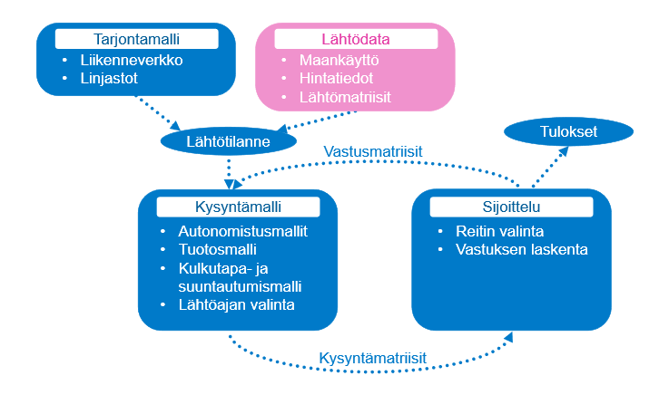

# HSL:n liikenne-ennustejärjestelmän yleiskuvaus

HELMET on HSL:n liikenne-ennustemallijärjestelmä, joka kattaa Helsingin seudun 14 kuntaa ja Siuntion (Tästä Helsingin seutu + Siuntio joukosta käytetään usein termiä HS15), sekä niitä ympäröivän työssäkäyntialueen, johon kuuluu koko Uusimaa ja lisäksi Varsinais-Suomen, Kanta-Hämeen ja Päijät-Hämeen kuntia.
Uusin malliversio HELMET 5 julkaistiin marraskuussa 2025. Järjestelmä käyttää Bentleyn julkaisemaa OpenPaths Emme-ohjelmistoa.

HSL:n HELMET-liikenne-ennustemallia voidaan käyttää arvioimaan erilaisten muutostekijöiden vaikutuksia liikennejärjestelmään.
Mallia hyödynnetään ja kehitetään erityisesti palvelemaan seudullisen MAL-suunnitelman vaikutusten arviontia.
HSL ja muut tahot käyttävät HELMET-mallia myös monissa muissa töissä, kuten linjastosuunnitelmien vaikutusten arvioinnissa sekä liikennehankkeiden hankearvioinneissa.

Mallin avulla saadaan tietoa suunnitteluratkaisuihin ja valintoihin jo suunnitteluprosessin aikana, ja sen avulla arvioidaan suunnittelun vaikutuksia ”etukäteen”.
Malli tuo esiin esimerkiksi linjastosuunnitelman tai liikennehankkeen vaikutukset/vaikutuksia kulkumuotojakaumaan,
matka-aikaan, saavutettavuuteen, matkamääriin ja liikennesuoritteisiin.

## Mallijärjestelmän rakenne

HELMET 5 -mallijärjestelmässä mallin neljä porrasta mallinnetaan seuraavassa järjestyksessä:
1. Matkatuotos
2. Kulkutavanvalinta
3. Suuntautuminen
4. Sijoittelu

Mallijärjestelmän rakenne on esitetty tarkemmin seuraavassa kuvassa: 

Mallijärjestelmää kuvataan tarkemmin raportissa (KORJAA) [Helsingin seudun työssäkäyntialueen liikenne-ennustejärjestelmän kysyntämallit 2020](https://staticfiles.hsl.fi/globalassets/julkaisuarkisto/2020/6_2020_helsingin_seudun_tyossakayntialueen_liikenne-ennustejarjestelman_kysyntamallit.pdf).

## HELMET 5 uusia ominaisuuksia

Tässä on kuvattu keskeisiä nostoja HELMET 5:n uusista ominaisuuksista sekä eroavaisuuksista HELMET 4:een verrattuna.
Laajemmin aihetta on kuvattu raportissa [Helsingin seudun työssäkäyntialueen liikenne-ennustemallijärjestelmän 2025 kehitystyö](https://staticfiles.hsl.fi/globalassets/julkaisuarkisto/2020/6_2020_helsingin_seudun_tyossakayntialueen_liikenne-ennustejarjestelman_kysyntamallit.pdf). 

### Kulkutapa- ja suuntautumismallien rakenne

Kuten HELMET4 4 -malliversiossa, kulkutapa- ja suuntautumismallien rakenne on HS15 -alueella kaksitasoinen: Kulkutapa- ja suuntautumismallissa yksittäinen vaihtoehto koostuu sekä kulkutavasta että suuntautumisesta yhdessä siten, että suuntautumisvaihtoehdon hyöty on kulkutavasta riippuva. Liityntäpysäköinti mallinnetaan uutena, omana kulkutapanaan, ja se jaetaan sijoittelussa auto- ja joukkoliikenneosamatkoiksi.

### Aluejako

HELMET 5 -mallissa on aiempaa enemmän sijoittelualueita Itä- ja Länsi-Uudellamaalla. Laajennustyö on toteutettu Uudenmaan liiton tilaamana erillisenä työnä vuonna 2021, ja laajennus on integroitu osaksi HELMET-mallia HELMET 5 -päivitystyön yhteydessä. Vuoden 2021 muutosten lisäksi myös liikenneverkko on tarkistettu ja päivitetty ympäryskuntien alueilla.

### HSL-alueen ulkopuolinen joukkoliikenne

HSL-alueen ulkopuolinen joukkoliikenne on päivitetty vastaamaan vuoden 2023 tarjontaa GTFS-aineiston pohjalta. Joukkoliikenteen tarjonta sisältää nyt myös muiden kaupunkiseutujen seudullisen joukkoliikenteen.

### Pysäköintiin kuluva aika osana autoliikenteen matka-aikaa

HELMET 5 -malliversiossa pysäköintiin kuluva aika huomioidaan henkilöautomatkoilla erillisenä vastustekijänä. Mallissa jokaiselle sijoittelualueelle määritetään pysäköintiaika, joka mallintaa pysäköintipaikan löytymiseen ja pysäköintiin kuluvaa aikaa, ja joka riippuu alueen asukas- ja työpaikkatiheydestä. Pysäköintiaika huomioidaan vastustekijänä kulkutavanvalinnassa sekä suuntautumisessa. Pysäköintiin liittyvä lisävastus laskee henkilöauton houkuttelevuutta ja kulkutapaosuutta erityisesti keskusta-alueelle suuntautuvilla kiertomatkoilla ja vaikuttaa osaltaan myös matkojen suuntautumiseen.

### Säteittäisväylien päiden kapasiteetin korjaus

HELMET 5 -malliversiossa säteittäisväylien välityskykyä on pienennetty vastaamaan paremmin todellista liikennevalojen rajoittamaa verkon välityskykyä keskustaan päin suuntautuvalla liikenteellä. Korjattu kapasiteetti vastaa tarkemmin toteutunutta välityskykyä ja kasvattaa ruuhkatuntien matka-aikoja keskustaan.

### Kantakaupungin linkkien vapaan nopeuden muutos

HELMET 5 -malliversiossa Helsingin kantakaupungin alueella käytetyn linkkityypin 42 vapaan nopeuden arvoa on pienennetty vastaamaan paremmin todellisia matka-aikoja Helsingin keskusta-alueella. Muutoksen myötä keskustan katuverkolla tapahtuvien automatkojen matka-ajat kasvavat, jolla on selkeä vaikutus reitinvalintaan ja osaltaan myös kulkutavanvalintaan ja suuntautumiseen.

### Joukkoliikenteen ruuhkautuvuus

HELMET 5 -malliversiossa ruuhkautuvan joukkoliikenteen sijoittelu on otettu käyttöön kaikilla malli-iteraatioilla. Tämä tarkoittaa, että joukkoliikenteen ruuhkautumisen vaikutukset otetaan huomioon koko mallinnusprosessin ajan, ei vain loppusijoitteluvaiheessa. Lisäksi ruuhkautumista kuvaavaa funktiota on tarkennettu siten, että se vastaa Väyläviraston määrittelemiä yksikköarvoja. Uuden ruuhkautumisfunktion mukainen koettu matka-aika kasvaa aiempaa maltillisemmin tilanteissa, joissa joukkoliikennevälineen kapasiteetti loppuu kesken.

### Joukkoliikennevälineet

Joukkoliikennevälineiden kapasiteetteja on tarkistettu ja uusia vaihtoehtoisia joukkoliikennevälineitä on lisätty. 
 * Runkobussilinjoilla käytettävissä nivelbussi
 * Lähijunaliikenteessä mahdollisuus käyttää 1-, 2- tai 3-yksikköisiä Sm5-kokonaisuuksia, aiemmin vain 2-yksikköinen käytössä.
 * HSL-alueen ulkopuolisessa joukkoliikenteessä käytetään kaukobusseja, joissa istumapaikkoja on aiempaa enemmän, mutta seisomapaikkoja ei lainkaan
 * Pika-kaukobusseille on mahdollisuutena myös kaksikerroksinen bussi

Vaihtoehdoista HSL:n tarjoamissa verkoissa on käytössä ainoastaan nivelbussit linjoilla 20, 30, 40, 560 ja 570, sekä kaksikerroksiset bussit OnniBus MEGA -linjoilla. Muut muutokset ovat käytettävissä harkinnanvaraisesti erilaisissa tarkasteluissa.

### Liityntäpysäköinnin mallinnus

Liityntäpysäköinti on tuotu osaksi mallin kulkutapoja. Liityntäpysäköinti tapahtuu kahtena osamatkana, joista ensimmäinen osamatka tehdään autolla ja toinen joukkoliikenteellä. Liityntäpysäköintiä varten malliin on kuvattu seudun liityntäpysäköintilaitokset ja niiden kapasiteetit ja mahdollinen hinta. Liityntäpysäköintilaitokset on kuvattu sentroideina, joiden numeroavaruus on 35 000 - 35 999.

### Pyöräilyn mallinnus

Pyöräilyn mallintamista on kehitetty HELMET 5 -versiossa aiemman HELMET 4 -version kehitystyön jatkona.

* Pyöräilyn väyliä on tarkistettu laajasti HS15-alueella.
* Pyöräliikenteeseen eivät enää vaikuta autoliikenteen kääntymiskiellot.
* Pyöräliikenteen kysyntä ei perustu enää matkan pituuteen vaan matka-aikaan.
* Pyöräliikennettä ei enää pääsääntöisesti kuvata moottoriteille, ja moottoriteiden rinnakkaiset pyöräväylät on kuvattu omina linkkeinään Helsingissä ja Espoossa.
* Pyöräilyn reitinvalintaan vaikuttavat myös maastonmuodot ja samalla väylällä kulkeva autoliikenne.
  * Linkeillä uusi extra-attribuutti @kaltevuus, joka tuotetaan automaatiolla.
  * Solmuilla uusi extra-attribuutti @korkeus, jota voidaan käyttää vaihtoehtona kaltevuudelle verkkoja koodatessa.

### Käytettävyysparannukset

Mallin käytettävyyttä on pyritty parantamaan selkeyttämällä virhetilanteiden viestintää ja kehittämällä verkkovalidointia ennen malliajoa

 * Tapaukset, joissa joukkoliikennelinjojen reitti ylittää saman linkin useita kertoja ilmoitetaan käyttäjälle
 * Täyttyneistä joukkoliikennelinjoista ilmoitetaan käyttäjälle
 * Mallijärjestelmä ilmoittaa ongelmasta aiempaa nopeammin ja selkeämmin, jos käyttäjä haluaa käyttää esilaskettua joukkoliikenteen kustannusmatriisia tai ajaa vain loppusijoittelun, mutta skenaarion tuloskansiosta puuttuu vaaditut matriisit.
 * Ja muita pienempiä käytettävyysparannuksia

## Mallintamisen taustoja

### Termejä

* **Malli:** Matemaattinen kuvaus järjestelmästä (tässä tapauksessa Helsingin seudun liikkumisesta)
* **Mallin estimointi:** Mallin parametrien määritys niin, että malli kuvaa käytetyillä lähtötiedoilla mahdollisimman hyvin lähtöaineistossa (nykytila) havaittua käyttäytymistä 
* **Mallin validointi:** Testaus, että malli tuottaa nykytilalle oikean tuloksen
* **Ennusteskenaario:** Mallin käyttö _samoilla parametreilla_, mutta _eri lähtötiedoilla_ kuin estimoinnissa

### Mallin oletuksia, perusteluita ja rajoituksia

Oletuksena yksilöiden hyödyn maksimointi:
* Malli olettaa, että ihmiset ovat tietoisia kaikista vaihtoehdoista ja niiden hyödyistä ja haitoista.
* Malli tekee ainoastaan ihmisten oman hyödyn maksimoivia valintoja.
* Todellisuudessa ihmisten päätöksenteko ei ole näin suoraviivaista ja rationaalista, mutta hyötymaksimointi on mallintamisessa yleisesti käytetty oletus.

Malli perustuu nykytilan havaintoaineiston valintoihin:
* Oletetaan, että tulevaisuusskenaarioissa ihmiset tekevät valintansa samoilla perusteilla kuin havaintoaineistossa eli nykytilassa.
* Ennusteita ei voida tehdä asenteiden muutoksista (jos matka-aikaa, kustannuksia ym. arvostetaan eri tavalla kuin nykyisin).
* Radikaaleja muutoksia toimintaympäristössä on haastava ennustaa ja siten mallintaa. Esimerkiksi koronaviruspandemia ja siitä seurannut etätyön lisääntyminen vaikuttaa pysyvästi mallin tuloksiin, mutta sitä ei ole voinut kuvata todenmukaisesti mallilla, joka oli estimoitu pandemiaa edeltävällä liikkumistutkimusaineistolla.

Mallin matemaattinen pohja perustuu diskreetteihin valintamalleihin:
* Mallijärjestelmä rakentuu useista eri osamalleista, joissa kuvataan logit-malleilla todennäköisyyttä, että päätöksentekijä valitsee tietyn vaihtoehdon (esim. kulkutapa).
* Teoriapohjaksi ks. esim. Kenneth Trainin e-kirja "[Discrete Choice Methods with Simulation](https://eml.berkeley.edu/books/choice2.html)" luku 2 ("Properties of Discrete Choice Models") s. 11-23.

Tyypillisesti liikennemallit jakautuvat neljään osaan, jotka on kytketty toisiinsa:
* _Matkatuotos_ eli matkojen määrät lähtö- ja määräpaikoittain
* _Suuntautuminen_ eli lähtö- ja määräpaikkojen yhdistelmät
* _Kulkutavan valinta_ eli matkojen jako mm. henkilöauton, joukkoliikenteen ja pyöräilyn kesken
* _Sijoittelu_ eli reittien valinta
