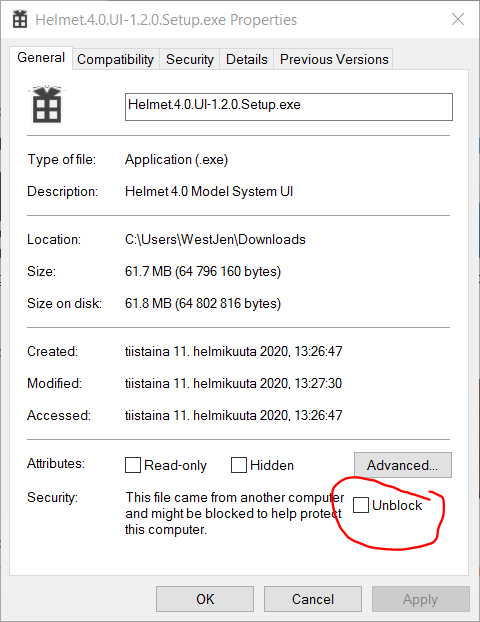

# Asennus

Tässä ohjeessa kuvataan [HELMET 5.0-liikenne-ennustejärjestelmän](https://github.com/HSLdevcom/helmet-model-system) käyttöliittymää. 
Järjestelmä käyttää Bentleyn [OpenPaths EMME–ohjelmistoa](https://www.bentley.com/software/openpaths/).

## EMMEn asennus

Ennen kuin HELMET UI -käyttöliittymää voidaan käyttää, seuraavien edellytysten on täytyttävä:

1.	[OpenPaths EMME](https://www.bentley.com/software/openpaths/) on asennettu, lisenssi on aktivoitu.
2.	Käyttäjän PATH -ympäristömuuttujiin on lisätty `%EMMEPATH%\programs`.
    -	Avaa Windows-järjestelmän Ohjauspaneeli
    -	Valitse Käyttäjätilit ja vielä uudelleen Käyttäjätilit. Valitse sen jälkeen vasemmalla olevasta valikosta ”Muuta ympäristömuuttujia”.
    -	Etsi ylhäällä olevasta laatikosta ”käyttäjän (oma_käyttäjätunnuksesi) muuttujat”, valitse Path-muuttuja ja ”muokkaa ympäristömuuttujia”.
    -	Valitse "Uusi" ja kirjoita `%EMMEPATH%\Programs`
    -	Paina OK ikkunassa ”Muokkaa ympäristömuuttujia” ja vielä uudelleen OK ikkunassa ”ympäristömuuttujat”.
3.	[valinnainen] [HELMET 5.0 Model System](https://github.com/HSLdevcom/helmet-model-system) on ladattu käyttöön ja määritelty 
   _(tai annetaan tämän käyttöliittymän ladata se)_

## EMME-projektin määrittely

Seuraavaksi sinun on määriteltävä *EMME-projekti*. 
Kutakin projektia varten kannattaa luoda yksi yhteinen EMME-projektipankki, johon kootaan eri HELMET-skenaariot (esim. eri linjastovaihtoehdot).

1. Käynnistä Openpaths EMME-ohjelmisto.
2. Perusta uusi projekti. Määrittele, mihin kansioon haluat sen asentaa. 
   - EMME muodostaa tiedoston `projektin_nimi.emp` kansioon `projektin_nimi` ja sen alikansioon 
     `projektin_nimi\database` suuren binaaritiedoston `emmebank` sekä muitakin alikansioita ja tiedostoja.
3. Noudata [erillistä ohjetta](sijopankki.md), jossa kerrotaan mm. sopivista dimensioista (solmujen, linkkien ym. maksimimäärät). 
   Ne vaikuttavat em. `emmebank`-tiedoston kokoon. Aja sisään verkot ja linjastot ohjeen mukaan.

## HELMET-asennus

### Helmet käyttöliittymä

HELMET-käyttöliittymän asennustiedosto ladataan [releases-sivulta](https://github.com/HSLdevcom/helmet-ui/releases).
Asennustiedosto on nimeltään `Helmet-UI.x.y.z.Setup.exe`, jossa `x.y.x` on käyttöliittymän
versionumero. Käyttöliittymällä voidaan käyttää mallijärjestelmän eri versioita, eikä se ole riippuvainen mistään tietystä versiosta. Suosittelemme uusimman version eli sivulla ylimpänä olevan version lataamista.

:warning: **Sovellus on niin harvoin asennettu, että Windows tai selain voi huomauttaa siitä ja
estää asennuksen suorituksen. Tämä voidaan ohittaa eri tavoin, joista voit joutua käyttämään
useampaa yhtä aikaa:**

- Ladatessasi tiedostoa, klikkaa "Säilytä silti" mikäli selain ei tallenna tiedostoa
  automaattisesti.
- Kun avaat asennustiedoston, klikkaa varoitukseen "More info" ("Lisätietoja") ja klikkaa "Run
  anyway" ("Suorita joka tapauksessa").
- Klikkaa ladattua .exe-tiedostoa hiiren kakkospainikkeella, valitse Ominaisuudet ja laita rasti
  ruutuun "Unblock" ("Salli").

 
Sovellus asentuu käyttäjän koneelle kansioon `%HOMEPATH%/AppData`. Varsinainen sovellus on kansiossa `AppData\Local`, ja sen asetukset 
kansiossa `AppData\Roaming`. 
Jos käyttäjällä jostain syystä ei ole pääsyä `AppData`-kansioon, vaihtoehto on sovelluksen lataaminen zip-tiedostona ja purku haluamaansa kansioon.

Kun sovellus käynnistetään ensimmäistä kertaa, se yrittää löytää työasemalta EMME-asennuksen ja ladata 
[HELMET 5.0 -liikenne-ennustejärjestelmän (model system)](https://github.com/HSLdevcom/helmet-model-system) 
uusimman version skriptit, jos asennusta ei ole valmiina. Sovellus suorittaa myös komennon `pip install --user -r requirements.txt`, joka asentaa mallijärjestelmän vaatimat Python kirjastot. 
Nämä kommennot pyörivät hiljaa taustalla, ja sovellus alkaa reagoida vasta niiden valmistuttua.

EMMEn Python-polussa oleva määrittely saattaa epäonnistua, 
jos ympäristömuuttujaa `EMMEPATH` ei ole määritelty tai jos sovellus on asennettu epätavallisella tavalla. HELMET-käyttöliittymän pitäisi asettaa ympäristömuuttuja automaattisesti samalla, kun valitaan käytettävä EMMEn Python asennus.

### Helmet mallijärjestelmä
Uusimman HELMET mallijärjestelmän julkaisun voi ladata suoraan HELMET käyttöliittymässä, ja käyttöliittymä ehdottaa sen lautausta myös automaattisesti, jos mallijärjestelmää ei ole valmiiksi asetettuna. 

Jos kuitenkin halutaan käyttää jotakin muuta mallijärjestelmän versiota, esimerkiksi jotakin kehitysversiota, tai vanhaa mallijärjstelmäversiota, mallijärjestelmä voidaan myös ladata erikseen [GitHubista](https://github.com/HSLdevcom/helmet-model-system), ja valita se sitten HELMET käyttöliittymän Asetukset valikossa.
