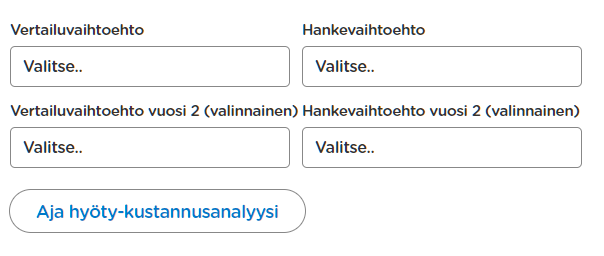
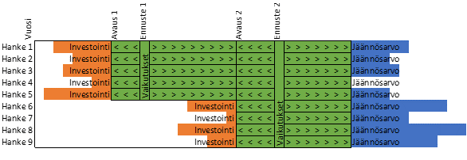

# Vaikutusten arviointi

Vaikutusten arviointi nojaa usein Väyläviraston ylläpitämään [hankearviointiohjeistukseen](https://vayla.fi/suunnittelu/hankkeiden-suunnittelu/vaikutusten-arviointi/liikennevaylat) siinä, millaisia oletuksia voidaan tehdä. Edellä mainittujen ohjeiden noudattaminen on usein myös edellytys arvioinneissa, joissa valtio on mukana kumppanina tai joita valtio hyödyntää päätöksenteossaan. Myös useimmat liikennejärjestelmävertailut pohjautuvat hankearviointiohjeiden mittareihin, vaikka niitä hyödyntäisivät vain kuntatoimijat. 

Arvioinneissa ei ennakoida tulevaisuuden poliittisia päätöksiä esimerkiksi eri kulkutapojen hinnoittelun tai priorisoinnin osalta. Vaikutusten arviointia tehtäessä ja niiden tuloksista viestiessä on myös oltava tietoinen niistä oletuksista, joita vaikutusten arvioinnissa on tehty. Yhteiset oletukset tulevaisuudesta mahdollistavat eri hankkeiden ja politiikkatoimenpiteiden vaikuttavuuden vertailtavuuden. Toisaalta strategiatyössä poliittiset päätökset sekä liikennehankkeista että muista toimenpiteistä kuten liikenteen ja pysäköinnin hinnoittelusta ovat tavoitteiden saavuttamisen välineitä. Tällöin tarvitaan skenaariotarkasteluita hankkeiden ja muiden politiikkatoimenpiteiden yhdistelmillä.

## Hyöty/kustannuslaskennan-työkalu

HELMET-mallin käyttöliittymässä on mukana H/K-laskelmatyökalu, joka auttaa tuottamaan hankearvioinneissa käytettäviä vertailulaskelmia. Työkalulla voidaan verrata ajettujen skenaarioiden hyötyjä ja kustannuksia. Analyysia varten on määriteltävä:

1. Vertailuvaihtoehdon (ve0) tuloskansio (`Tulosten tallennuspolku\Skenaarion nimi`)
2. Hankevaihtoehdon (ve1) tuloskansio 

Jos ennusteita on ajettu kahdelle vuodelle (esim. 2040 ja 2060), vertailuvaihtoehto ja hankevaihtoehto on mahdollista määrittää toisellekin ennustevuodelle.

*Kuva 1. Työkalun käyttö HELMET käyttöliittymässä.*

Työkalu tuottaa Excel-tiedoston, joka tallennetaan samaan kansioon, jossa vertailuvaihtoehdon tuloskansio sijaitsee. Excel tiedoston etusivulla on esitäytetty H/K laskelma, johon on käsin lisättävä hankkeen kustannukset, jotta lopullinen H/K laskelma voidaan tehdä. Excel-tiedoston muilla välilehdillä on mallin tuottamat tiedot, sekä yksikköarvot, joiden avulla yhteiskuntataloudelliset hyödyt lasketaan. Hankearviointeja tehtäessä on varmistettava, että yksikköarvot ovat ajantasaiset ja oikean vuoden hintatasossa. 

## Excel-tulostiedoston kuvaus

Laskentamalli on excel-taulukko, jossa on kuvattuna kustannus-hyötyanalyysin hyöty- ja kustannuserät sekä niiden laskentamenetelmät. Yksittäiset lukuja sisältävät solut ovat joko laskentakaavoja, yksikköarvoja, HELMET-mallin tuloksia, tavoitevuoden (2030 tai 2050) tai laskentaerän nykyarvon summia.  

Solujen määritelmät: 

<ul style="list-style-type: none; padding-left: 10;">
  <li> Laskentakaava</li>
  <li> Yksikköarvo</li>
  <li> Suoraan mallista</li>
  <li> Tavoitevuoden muutos laskentaerässä</li>
  <li> Nykyarvon summa laskentaerässä</li>
</ul>

*Kuva 2. Laskentamallin selitteet.*
 

Jokainen väliotsikko kuvaa kunkin laskentakehikon välilehden sisältöä. 

### Diskonttaus 

Kuvassa 3 on esitelty diskonttauksen periaatteet erityisesti vuoden Helsingin seudun liikennejärjestelmäsuunnitelma 2027:n kustannushyötyanalyysiä varten. 

*Kuva 3. Diskonttauksen periaatteet kuvattuna.*

Hankkeen vaikutukset alkavat avausvuodesta ja jatkuvat koko tarkastelujakson aikana. Tarkastelujakso on 30 vuotta.  

Vaikutuksia voidaan laskea yhdestä tai kahdesta ennustevuodesta. Mikäli lasketaan vaikutuksia kahdesta ennustevuodesta, avausvuosi 1 määrittää milloin ensimmäisen ennustevuoden vaikutukset astuvat voimaan ja avausvuosi 2 määrittää milloin toisen ennustevuoden vaikutukset astuvat voimaan. Tarkastelujakso alkaa aina ensimmäisestä avausvuodesta. Avausvuosi ja ennustevuosi voi olla sama. 

Ensimmäiselle ja toiselle avausvuodelle voidaan määrittää eri investointikustannuksia. Investointi loppuu aina avausvuoden edellisenä vuotena ja sen vaikutukset alkavat avausvuodesta. Voidaan siis analysoida useita eripituisia ja erihintaisia hankkeita kokonaisuutena, kunhan avausvuosi pysyy kaikissa samana. Ne hankkeet, jotka alkavat avausvuodesta 2 saavat lyhyemmän tarkastelujakson kuin hankkeet, jotka alkavat avausvuodesta 1. Jäännösarvo on siis isompi projektille, jotka valmistuvat avausvuonna 2. Esim. jos avausvuosi 1 on 2030, avausvuosi 2 on 2050 ja tarkastelujakso on 30 vuotta, vaikutukset lasketaan vain kymmenestä vuodesta projektille, jotka valmistuvat avausvuonna 2. Jäännösarvo voi tässä tapauksessa olla suuri. Mikäli lasketaan vaikutuksia vain yhdestä ennustevuodesta, avausvuosi 2 jää tyhjäksi. Sillä ensimmäisen ennustevuoden vaikutukset jatkuvat tarkastelujakson viimeiseen vuoteen asti. 

Suunnitelman investoinnit viedään vuoden 2023 hintatasossa sellaisinaan vuodelle 2030. Jotta tämä voidaan tehdä, teemme oletuksen siitä, että hyötyjen sekä kustannusten arvostus muuttuu yhteneväisesti hintatasojen perusvuoden ja suunnitelman aloitusvuoden sekä diskonttausvuoden välillä. 

### Käyttäjähyödyt 

Käyttäjähyödyt lasketaan HELMET:n avulla saatavista suoritematriiseista, joista automaattisesti tulostetaan tarpeelliset suoritemuutokset ”Kayttajahyodyt” –välilehdelle. Suoritteet on laskettu aamuhuipputunnille (AHT), huippujen ulkopuolisen ajan (päivä) ja iltapäivän huipputunnille (IHT) erikseen. Suoritemuutokset kerrotaan yksikköarvoilla, joiden myötä saadaan laskettua kuluttajaylijäämän muutokset.  

Tuottajahyötyjen ohessa lasketaan mahdollisten tienkäyttömaksujen kokonaissumma ja tätä käsitellään liikennetaloustieteen tutkimuskirjallisuuden perusteella yhteiskuntataloudellisena hyötyeränä. 

Erityishuomioita: 

* Kulkumuodon vaihtajille käytetään puolikkaan sääntöä. 
* OD-parien välillä lisääntyneille (erotukselle) käytetään puolikkaan sääntöä. 

### Tuottajahyödyt 

Tuottajahyötyihin lasketaan liikennöintikustannukset ja väylänpidon kustannukset. Lisäksi tuottajille koituvat verot ja maksut lasketaan tuottajahyödyissä kustannuksiksi ja vastaavasti kohdassa ”Julkistaloudelliset” hyödyksi.  

Liikennöintikustannukset lasketaan HELMET-mallista saatavilla kilometrisuoritetiedoilla sekä suoritetyypin mukaisilla kulkumuotokohtaisilla yksikköarvoilla kerrottuina. 

Väylänpidon kustannukset lasketaan kertomalla väyläpituudet väylätyypeittäin ja kertomalla nämä niille määritettyjen yksikköarvojen avulla.  

Tuottajahyötyjen ohessa lasketaan lipputulojen kokonaissumma ja tätä käsitellään yhteiskuntataloudellisena hyötyeränä. 

Yksikköarvot ovat määritetty Liikenneviraston yksikköarvo-ohjeen sekä HSL:n omien tietojen perusteella. 

Erityishuomioita: 

* Lomien ja pyhäpäivien vuoksi vuositasolle viedyt kilometrisuoritteet on kerrottu kertoimella 300 eikä vuoden kokonaispäivämäärällä. 

### Ulkoisvaikutukset 

Ulkoisvaikutuksiksi lasketaan muutokset liikenteen päästöissä sekä henkilövahinko-onnettomuuksissa. Molemmat erät lasketaan kulkumuodoittain perustuen niiden HELMET-mallista saataviin tietoihin. Henkilöautojen osalta onnettomuuksissa otetaan huomioon myös väylätyypit. 

Päästöjen yksikköarvot perustuvat Liikenneviraston LIPASTO-aineistoihin ja onnettomuuksien yksikköarvot Liikenneviraston määrittämiin yksikköarvoihin. 

Erityishuomioita: 

* Melukustannuksille ei ole määritetty laskentatapaa ja peruslaskennassa ne jätetään peruslaskelmia tehdessä pois. 

### Julkistaloudelliset 

Veroja ja maksuja pyritään käsittelemään mahdollisimman tarkalla tasolla, jotta saadaan riittävä määrä aineistoa julkistaloudellisten vaikutusten arviointia varten. On kuitenkin muistettava, että tavoitteena on yhteiskuntataloudellisen laskelman kehittämissä, minkä vuoksi verojen ja maksujen käsittelyyn jäi vielä kehittämisvaraa.  

Suurin erä ovat verot ja maksut, jotka lasketaan ”käyttäjähyödyt”-välilehdeltä saatavista kilometrisuoritteista. ”Käyttäjähyödyt”-välilehdellä ajoneuvoliikenteen verot ovat laskettu valmiiksi ja ”julkistaloudelliset”-välilehdellä viitataan suoraan tähän arvoon. Mahdolliset tienkäyttömaksut myös lasketaan suoraan ”käyttäjähyödyt”-välilehdeltä sen vastalukuna tuottajahyödyissä ja täten siihen ei viitata ”julkistaloudelliset”-välilehdellä. 

Erityishuomioita: 
* Pysäköintimaksujen käsittely vaatii selvityksen. 
* Osa julkistaloudellisista vaikutuksista lasketaan käyttäjä- ja tuottajahyödyissä. 
* Muihin veroihin ja maksuihin kuin tiemaksuihin ei käytetä puolikkaan sääntöä. 

### Investointikustannus 

Investointikustannuksiksi lasketaan kaikki liikennejärjestelmään kohdistuvat kehittämistoimenpiteet, joista aiheutuu käyttökulujen lisäksi investointikuluja. Nämä investointikustannukset asetetaan laskentateknisistä syistä johtuen valmistumaan samana vuonna tarkasteluvuoden mukaisesti. Niiden kuluminen on määritetty ”Investointikustannus” –välilehdellä ja sen perusteella kehikko laskee kullekin toimenpiteelle valmiit jäännösarvot 30 vuoden poistoajalla mitattuna. 

Investoinnit muutetaan kukin estimoinnin hintatasojen vuodelle, eli HELMET 5:ssä 2023. Tämän muokkauksen jälkeen investoinnit ositetaan vuotuisiksi kustannuksiksi ”investointikustannus”-välilehdelle ylimpään taulukkoon. 